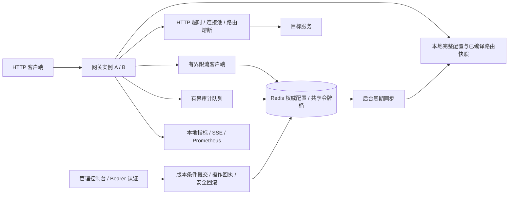

# ZenithGateway

面向 Java 后端与平台工程岗位展示的响应式 API 网关。重点是让配置并发、Redis 故障、请求取消和运行结果有清楚的语义，并用独立实验复验。

[启动与接口](docs/development-guide.md) · [三个工程案例](docs/backend-case-studies.md) · [控制台与演示](docs/product-showcase.md) · [版本与证据索引](docs/evidence-index.md) · [候选发布记录](docs/showcase-release.md)

## 先看什么

| 用时 | 阅读路径 |
| --- | --- |
| 2 分钟 | 本页架构与能力边界 |
| 5 分钟 | 三个案例中的问题、取舍、故障实验 |
| 10 分钟 | 启动控制台，浏览真实概览、路由与版本化配置 |
| 完整复验 | 执行统一验收，查看提交、JAR 哈希、故障样本及清理报告 |

## 架构与一致性边界



配置与路由在 Redis 发布，各实例异步采用；代理请求读取本地快照，不增加逐请求配置查询。限流仍需原子访问共享桶。一次提交成功确认存储事实，不能代表所有实例同时采用；回执有明确保留窗口，不提供跨 Redis 故障切换的永久 exactly-once。

| 能力 | 实现与边界 |
| --- | --- |
| 运行配置 | 六字段不可变快照、expectedVersion、operationId、提交回执；历史恢复生成新版本 |
| 动态路由 | 独立路由版本、整份快照校验、编译后切换、后台同步与本地生效诊断 |
| 分布式限流 | Redis 时间与 Lua 原子令牌桶；有界准入和命令；本地/Redis 故障策略分别选择 allow 或 reject |
| 代理保护 | 连接、响应头、读停顿和总时限；502/504/503 分类；路由熔断隔离；自动重试关闭 |
| 运行与退出 | readiness、逐步接流量、停止准入、在途和审计有界排空；真实 HAProxy 替换验证 |
| 可观测性 | 事实、动作、扣费确认与最终 HTTP 结果分开；Prometheus 告警和 Grafana 可定位到实例 |

## 启动项目

已验证工具链：Microsoft JDK **21.0.12.1**、Node **24.21.0**、Redis **7.4.11**、Maven Wrapper **3.9.16**。项目锁定 Spring Boot 4.1.1 / Gateway 5.0.3；依赖和迁移见[执行记录](docs/dependency-upgrade-execution.md)。这些是本项目验证版本，不表示所有较新版本都已验证。

Windows PowerShell，从仓库根目录运行（先设置 JAVA_HOME 并将 Node/npm 加入 PATH）：

```powershell
.\dev.ps1 -CheckOnly
.\dev.ps1
```

打开 **http://127.0.0.1:5173**。启动器构建后端、按需安装前端依赖，等待 readiness；Ctrl+C 退出并排空审计。默认端口被占用时可指定 `-BackendPort 8081 -FrontendPort 5174 -RedisPort 6380`。

使用 dev profile，仅绑定本机；开发模式允许空管理口令。如果已有 ZENITH_ADMIN_TOKEN，则仍使用该令牌，控制台运行时输入，不能写入前端构建。对外部署须使用管理认证及环境注入，不能直接暴露 dev 模式。

启动器检查 Redis；不可达时可通过 Docker 启动独立开发 Redis 并保留命名数据卷。已有 Redis 会被复用，旧格式必须先按[路由迁移](docs/backend-route-publication.md)和[配置迁移](docs/backend-config-rollback.md)处理。首次体验请使用专属端口和空数据，勿删除现有键来绕过版本保护。

Linux/macOS 的构建、手动启动、首次建路由、认证与 API 示例见[详细指南](docs/development-guide.md)。目录为 backend/、frontend/；仓库根目录没有后端 pom.xml。

## 查看与复验

- 控制台正式页面连接真实后端。`/overview/preview`、`/routes/preview`、`/settings/preview` 是明确标注的隔离演示，不代表真实系统状态。
- [80 秒控制台录屏](docs/media/stage-c-product-demo.webm)属于早期 UI 阶段；[真实 HAProxy 替换录屏](docs/backend-rolling-replacement-demo.webm)及各自版本/边界见[展示页](docs/product-showcase.md)。
- [仓库内证据索引](docs/evidence-index.md)提供可校验压缩原始记录、摘要、曲线和复验命令。它区分历史实验、当前候选回归和未执行检查。

```powershell
# 干净源码；每次使用新的输出目录，需要 Docker Linux 容器
node verification/acceptance.mjs --tier commit --out .dev/acceptance/commit-demo --images prepare
node verification/acceptance.mjs --tier release --out .dev/acceptance/release-demo --images prepare
```

commit 层运行后端真实 Redis 测试、前端测试和构建、工具测试、监控规则；release 层再运行十个独立故障入口。每轮只用一个构建包并核对哈希，报告包括失败、not_run 和清理。新 CI 与产物的对应关系见[候选记录](docs/showcase-release.md)，完整工具约束见[统一验收](docs/release-acceptance.md)。

## 性能结论

**单实例、4 个逻辑 CPU、1 GiB、小 HTTP 响应条件下，1000 req/s 一小时容量窗口通过；长期内存稳定性仍未证明，4000 req/s 一小时未通过。**

该结论绑定实际测试 JAR `3f73c65c7c29933549878c570a6b5a8b7bd8bafad2e5333603eee1de089da838`：3,599,568 次 200，P95/P99 为 3.869/5.555 ms，零故障放行、保护性拒绝或扣费未知，上游与审计相符。条件还包括 32 路由、无 TLS、单客户端桶、非持久化 Redis、监控/审计开启、交接关闭；详见[RSS 报告](docs/backend-rss-investigation.md)和[原始证据](docs/evidence-index.md)。

重新构建即重新记录产物身份；源码一致、业务测试通过或仅 ZIP 时间戳不同，都不自动把该小时结论迁移到新哈希。一次原生堆回收支持“存在分配器保留页”，不能用干预后下降证明自然稳定。

## 工程材料

- [配置一致性](docs/backend-config-consistency.md) / [幂等与回执](docs/backend-config-operations.md) / [安全回滚](docs/backend-config-rollback.md)
- [限流可靠性](docs/backend-rate-limit-reliability.md) / [故障策略](docs/backend-limiter-failure-policy.md) / [监控语义](docs/backend-limiter-monitoring.md)
- [代理容错](docs/backend-proxy-resilience.md) / [接流量与安全退出](docs/backend-traffic-lifecycle.md) / [真实滚动替换](docs/backend-rolling-replacement.md)
- [计数竞态修复](docs/backend-limiter-command-counter.md) / [RSS 归因](docs/backend-rss-investigation.md) / [可重复容量入口](benchmarks/CONSERVATIVE-CAPACITY.md)

本项目展示的是能定位、验证并说明边界的工程实现，未宣称生产多区域配置中心、最大容量、永久幂等或无损退出。候选发布不自动升级现有开发实例。
