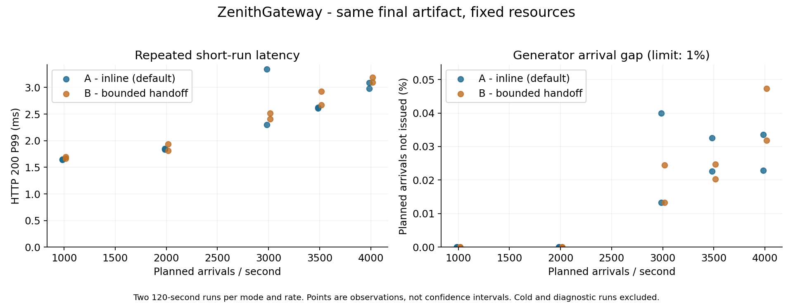
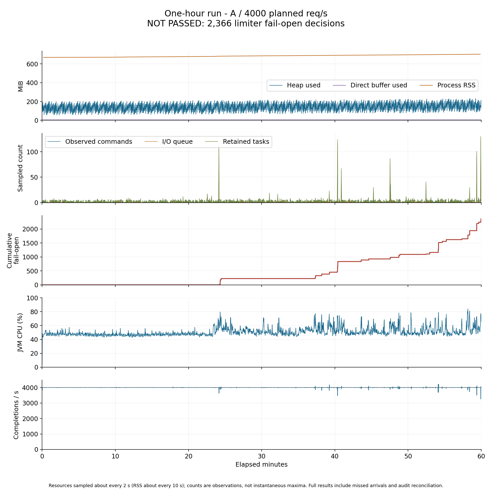

# 最终包容量定标与剩余饱和定位

2026-10-04 完成一次容量摸底、一次诊断对照及一次一小时长测。**4000 req/s 一小时未通过：14,395,108 个 HTTP 200 中包含 2366 次限流故障放行。当前没有已通过一小时验证的可靠容量档位；不能把较低档位的短测通过改写成长测通过。交接继续默认关闭。**

完整索引：[backend-capacity-calibration-validation.json](backend-capacity-calibration-validation.json)。以下容量均限定到本文固定资源、预热、观测和工作负载。原始时间线使用 UTC。

## 最终包容量结果

正式短测共 20 段、6,478,600 个请求，全部满足预先固定的健康标准。每个模式、每个档位均测两次，每次 120 秒；下表分别列出两次 P99，不求平均。两次均为零故障放行、零异常响应、零审计对账差额。

| 模式 | 计划 req/s | 两次完成请求合计 | P99 第一次 / 第二次（ms） | 单段最大到达缺口 |
| --- | ---: | ---: | ---: | ---: |
| A 关闭交接 | 1000 | 240,000 | 1.641 / 1.648 | 0.00000% |
| A 关闭交接 | 2000 | 480,000 | 1.849 / 1.832 | 0.00000% |
| A 关闭交接 | 3000 | 719,808 | 2.303 / 3.341 | 0.04000% |
| A 关闭交接 | 3500 | 839,768 | 2.623 / 2.607 | 0.03262% |
| A 关闭交接 | 4000 | 959,729 | 2.983 / 3.089 | 0.03354% |
| B 开启交接 | 1000 | 240,000 | 1.665 / 1.698 | 0.00000% |
| B 开启交接 | 2000 | 480,000 | 1.809 / 1.939 | 0.00000% |
| B 开启交接 | 3000 | 719,864 | 2.407 / 2.517 | 0.02444% |
| B 开启交接 | 3500 | 839,811 | 2.923 / 2.671 | 0.02476% |
| B 开启交接 | 4000 | 959,620 | 3.095 / 3.187 | 0.04729% |

A 的 4000 req/s 在额外 120 秒长测前确认中再次通过：479,819 个请求、P99 3.283ms。随后完整执行 3600 秒；结果如下。

| 一小时指标 | 实测 | 判定 |
| --- | ---: | --- |
| 计划 / 实际完成 | 14,400,000 / 14,395,108 | 实际吞吐 3998.638 req/s |
| 到达未发出 | 4892（0.033972%） | 低于 1% 门槛 |
| HTTP / 传输错误 | 全部 200 / 0 | 通过 |
| P95 / P99 / 计划到达 P99 | 2.803 / 6.999 / 8.279ms | 通过 |
| 故障放行 | **2366，全部 queue_full** | **不通过，要求为零** |
| 准入饱和 / I/O 执行器拒绝 | 1648 / 718 | 交接执行器拒绝为 0 |
| 审计收到 / 落库 | 14,395,108 / 14,395,108 | 丢弃、不确定、待处理、对账差额均为 0 |
| 上游实际接收 / 监控完成 | 均为 14,395,108 | 与入口一致 |
| 采样错误 / 资源上限越界 | 0 / 0 | 通过 |

首次饱和样本出现在第 1449.069 秒，约 24 分 09 秒。后半程反复出现短时饱和；即使所有请求最终返回 200，也没有完成每次请求的 Redis 额度判断，所以不能认定限流健康。低于 4000 的档位只完成了重复短测，本轮不提供它们的一小时保证；高于 4000 未测。

一小时后完成分阶段降载：先排空并保存内存检查点，约 8.45 秒后开始 500 req/s × 120 秒。60,000 个请求全部 200、故障放行为零、P99 3.135ms、到达缺口为零。它是带检查点间隔的恢复验证，不是无缝的负载阶跃。随后约 10.39 秒观测到代理连接池归零；最终 A/B 的 I/O、结果队列、在途命令、保留任务、代理连接和审计待处理均为零，136 个准入名额全部归还。

## 冷启动与空闲恢复

| 场景（1000 req/s × 30 秒） | 入口 / HTTP 503 | 故障放行 | P99（ms） |
| --- | ---: | ---: | ---: |
| A 首次业务流量 | 29,797 / 31 | 8，executor_rejected | 145.407 |
| A 连接池归零后恢复 | 30,000 / 0 | 0 | 1.859 |
| B 首次业务流量 | 29,856 / 0 | 4，admission_full | 154.751 |
| B 连接池归零后恢复 | 30,000 / 0 | 0 | 1.842 |

A 新增的 31 个 503 同样来自 proxy_pool_full。两个冷启动阶段都不健康；B 虽没有 503，仍有故障放行和超门槛尾延迟。空闲恢复均通过，等待条件是实际连接池为零（A 14.32 秒、B 14.30 秒），不是猜测固定睡眠。上述结果不证明交接消除了冷启动风险，也不修改 readiness 的业务含义。

## 饱和现场与针对性对照

新增采样实际区分了三种现场：

- A 冷启动：I/O 队列 128、commandsInFlight=0、8 个工作线程正在同步交付结果；多个线程为 BLOCKED。说明“无未观察命令”不等于“I/O 工作线程可用”。
- B 冷启动：I/O 队列 0、结果队列 132、两个消费者在交付、136 个名额用尽。不能仅增加 Redis I/O 线程来解释或解决这类积压。
- A 一小时：52 个拒绝触发样本（35 个 admission_full、17 个 executor_rejected），I/O 队列观察值 114–128、命令数 1–8；工作线程阶段观察中，376 次为 redis_wait，33 次为 result_dispatch，7 次为 decode。这些是跨样本的线程观察数，不是失败请求数。52 个样本无游标缺口、无采集截断、无采样错误。

一小时样本中，有 67 次工作线程观察到 Future 结果已到但阶段仍在等待，最大观察差约 4.43ms；尚未观察到 Future 的线程也占多数。最老详细任务年龄最高约 112.63ms，包含此前排队，不能标为纯 Redis RTT。样本读取不是原子操作，阶段转换期间出现零年龄或已归还名额是允许的观察误差。

按预先使用的关联窗口（事件前 250ms、后 50ms），52 个长测事件有 37 个附近存在 safepoint，最大约 12.09ms，其余 15 个没有匹配停顿。首次事件附近另保留了 Redis 慢日志，同秒可见超过 1ms 的 EVAL、GET 等，局部 EVAL 达 7.932ms。慢日志与事件只有时间关联，不能逐请求归因；Redis 执行、网络往返、客户端回调及宿主/虚拟机调度贡献尚未完整拆开。

仅在唯一一对 4000 req/s × 120 秒诊断阶段开启 JFR 和额外调度观察：

| 模式 | 完成请求 | 故障放行 | P99（ms） | 到达缺口 |
| --- | ---: | ---: | ---: |
| A | 474,705 | 0 | 39.711 | 1.103125%，未过门槛 |
| B | 475,333 | 0 | 26.303 | 0.972292% |

两段没有饱和事件，不能用它们的线程剖面声称已经解释稍后长测的拒绝，更不能倒推旧包 B 的 492 次拒绝。开启额外观察的阶段明显更慢；采集成本、执行顺序和环境变化没有进一步拆分，所以这对结果不参与容量选档。

每模式读取了 12 次线程统计，实际首末窗口为 A 112.569 秒、B 112.645 秒，无错误和线程列表截断。A 的 8 个限流 I/O 线程合计运行 59.716 秒、运行队列等待 31.771 秒；B 的 8 个 I/O 为 24.864 / 20.142 秒，2 个结果线程另为 35.307 / 9.839 秒。这说明工作转移到了另一组线程，没有凭空减少所有工作量；累加的线程时间不能解释成请求延迟。两段 CPU cgroup throttled_usec 增量均为零，只排除了该指标记录的配额节流，不能排除其他调度等待。

JFR A/B 分别记录 258 / 259 次 GC，累计暂停 0.393 / 0.382 秒，最长暂停 22.33 / 12.60ms；未记录 DataLoss。执行样本主要涉及集合、字符串、HTTP 头和指标标签处理，不能仅凭采样次数或平均耗时决定增加线程。保留原始 JFR、GC 与 schedstat 数据供复核。

## 内存与资源恢复

| A 检查点 | RSS（MiB） | NMT committed（KiB） | Object Monitors（KiB） |
| --- | ---: | ---: | ---: |
| 长测前 | 669.53 | 560886 | 3847 |
| 长测后 | 703.88 | 571586 | 10053 |
| 降载并空闲后 | 704.29 | 560554 | 1 |

长测周期采样 RSS 峰值约 703.43MiB，前/后五分钟中位数约 670.18 / 701.62MiB。检查点 RSS 增加约 34.35MiB，未在短暂空闲后回落；NMT committed 增量约 10.45MiB，其中 Object Monitors 约 6.06MiB、Code 约 3.61MiB。空闲后监视器类别明显释放，NMT committed 回到基线附近，但 RSS 仍较高，尚未把差额完整归因到分配器、页驻留或其他原生内存。

Java 线程数在长测采样中始终为 50，直接内存中位数约 3.86MiB，堆 committed 为 256MiB，堆使用量随 GC 波动。未执行强制 GC、堆保留图分析或更长时间内存验证，因此不把一小时未越界写成“无内存泄漏”。

## 范围与判据

沿用 8 I/O / 128 队列 / 500ms 和可选 2 个结果线程，不调大线程或队列。固定单一最终包，测试 1000、2000、3000、3500、4000 req/s；两个方向重复短测，健康档才进入一小时长测。交接默认关闭。

容量标准在运行前固定：零故障放行、零意外响应错误或传输错误、到达缺口 ≤ 1%、审计完整、P95 ≤ 50ms、P99 ≤ 100ms、含计划到达等待的 P99 ≤ 150ms；无采样失败与资源越界。启动与空闲恢复单列，诊断录制不参与容量选择。

## 30 个历史 503 已归因

上一轮 warmup-B-1000 的全部 30 个失败响应体均为 proxy_pool_full；日志逐条对应 PoolAcquirePendingLimitException。前后上游接收差为 29,007，与成功响应数一致，恰好比 29,037 个入口请求少 30。后续首次代理快照累计 pool_full=30，circuit_open、pool_timeout、upstream_5xx 等错误计数均为 0，32 个断路器均关闭。

失败发生在发压后的 0.619–0.742 秒，B 的 readiness 已通过约 97 秒。因此可以确认拒绝发生在出站连接池等待准入边界，不能把 readiness 通过理解为业务转发路径已经预热。该证据本身没有将之前的初始化延迟唯一归因到建连、JIT、GC 或调度。

完整交叉记录：[historical-503-analysis.json](../.dev/capacity-calibration-20261004-4e10de3f/historical-503-analysis.json)。旧报告和原始证据保持不变。

## 有界的现场观察

事件采样为可选启动开关，默认关闭。触发于 admission_full / executor_rejected；128 条环、100ms 最小间隔，每次最多检查 256 个任务。常规诊断仅给摘要，独立管理接口按序号读取事件。请求线程不读 Redis、不抓堆栈、不创建采样线程或排队任务。

事件记录名额、两个队列、命令等待数、任务阶段与年龄、阶段线程状态、累计 GC。它是拒绝后的非原子观察，既不能代表所有拒绝，也不能证明每段墙钟时间的唯一来源。两模式启用相同采样；针对性 JFR/线程调度对照与容量数据分开。

执行方法：[CAPACITY-CALIBRATION.md](../benchmarks/CAPACITY-CALIBRATION.md)。运行前协议和源码基线保存在本轮证据目录。

## 固定资源、预热与判定口径

- 最终包 SHA-256：`2eb6c17bbc8121dcaef2fb131d143165a08b37e0d44a3ba23ca088809236946d`。新增诊断完成后冻结，全部新冷启动、空闲恢复、容量、针对性对照及长测均使用此包。两个功能故障回归也使用此包；没有把上一轮候选包的数字移作本轮结果。
- Docker Desktop / WSL2，VM 可见 16 个逻辑 CPU、约 15.49 GiB 内存。Redis 固定 CPU 0–1，受控上游 2–3，被测网关 4–7，负载生成器 8–11。两个网关共享 4–7，但同一阶段只给一个网关施加压测流量；另一个实例仍有少量后台任务。CPU 绑定不等于独占物理核心或独占 Windows 宿主。
- Redis 容器内存上限 256MiB，RDB 定时保存与 AOF 均关闭；慢日志阈值在所有测量开始前固定为 1000µs，最多保留 128 条。本轮容量不包含 Redis 持久化写盘成本。
- 单网关 1GiB 容器上限，JDK 21，G1，堆初始 256MiB / 最大 512MiB，直接内存上限 256MiB，ActiveProcessorCount=4，NMT summary。镜像 digest、完整启动参数与有效配置保存在 summary.json。
- capacity profile：I/O 8 线程、等待队列 128、决策预算 500ms。A 关闭结果交接；B 开启 2 个结果线程，共享 136 个准入名额。两者均开启本轮可选事件采样，默认配置的交接与事件采样仍关闭。额度 10000 / 10000 / 成本 1，32 条路由，共用受控快速 HTTP 上游，监控、审计和路由熔断开启。
- 开放到达模型，生成器最多 256 个在途请求。若来不及按计划发出，记录 schedulerMisses / capacityMisses，不把未到达请求计成网关完成。健康条件允许合计未发出比例至多 1%，同时报告实际吞吐；延迟保留单阶段分位数，不平均 P99。
- 独立播种实例准备路由后退出；A、B 第一次真实业务流量均为 1000 req/s × 30 秒。每次等真实代理连接池归零后再测空闲恢复。固定预热为 500 × 30 秒、1000 × 30 秒、2000 × 60 秒；每段正式短测前另做 500 × 15 秒准备。所有失败保留，准备段不充当正式容量样本。
- 正式顺序为 A 升档、B 升档、B 降档、A 降档。每模式每档实际两次、每次 120 秒。最高重复合格档参与长测选择；同档均合格时优先 A。一次 4000 req/s 的 JFR A/B 对照单独列出，不参与容量选档。长测前再做 120 秒确认，合格后运行一次 3600 秒；随后 500 req/s × 120 秒降载并等待连接池归零。
- 健康判定在执行前固定：故障放行、非 200、传输错误、审计丢弃/不确定/对账差额、采样失败、资源越界均为零；HTTP 200 P95 ≤ 50ms、P99 ≤ 100ms，包含计划到达等待的 P99 ≤ 150ms。

这里的“审计完整”是完成后 received / persisted / 请求完成数一致，dropped / uncertain / pending 为零。Redis 审计列表仍按原策略保留最近最多 5000 条，不声称可以事后逐条查询数千万条压测请求。

## 新增诊断的成本和解释

生产修改集中于 LimiterProperties、RedisRateLimiter、LimiterDiagnosticsController 和新增 LimiterSaturationSamples。事件只在 admission_full 或 executor_rejected 时尝试采样，环形上限 128 条、最短间隔 100ms；一次最多检查 256 个保留任务，详列其中最老 8 个，以及最多 64 个 I/O 槽位持有者。没有新增后台线程、定时器、Redis 访问或无界标签。关闭开关时不收集任务状态。

GET /settings/rate-limit/saturation?afterSequence=0 受原管理认证保护，响应 no-store，只观察本地数据。常规 diagnostics 只返回事件计数摘要；详细接口通过 sequence 增量读取。环覆盖后 cursorTooOld 明确表示证据缺口，不伪装完整事件流水。本轮采集器每阶段也最多保留 1024 个事件，另记截断数。一次采样失败只增加 captureErrors，不改变额度决定。

名额、队列、任务阶段与线程状态不是一次原子快照。拒绝后采样时可能已有名额归还；complete / queued 阶段的线程引用可能来自上次阶段转换，不能当成此刻正在执行该任务的线程。commandsInFlight 仍是“客户端尚未观察到结果或物理关闭”的命令数，不是 Redis 服务器同时执行的脚本数。

GC 日志贯穿各阶段。额外的 JFR 和 /proc 调度观察只在一对针对性阶段运行：JFR profile 限 64MB / 180 秒，调度读取最短间隔 10 秒，每模式最多 24 次、每次最多 128 条线程。本机全局 sched_schedstats=0，但每线程 schedstat 的运行与等待计数实际增长。已核对对应 WSL 6.6.87.2 源码：该接口读取 CONFIG_SCHED_INFO 对应的运行/等待计数，并非只由全局 schedstats 开关决定。它们是多线程累计量，不能换算成单个请求的延迟贡献。零值或不增长不能用来证明没有调度等待。诊断观察有成本，因此与容量成绩分开。

## 兼容、复现与范围

没有修改令牌桶算法、运行配置六字段、路由协议、Redis 格式、故障放行策略、线程/队列默认大小或默认交接模式。新增诊断字段为附加信息。部署需要另行升级 JAR；本轮没有升级开发实例。若需要观测同样的现场，显式使用 `--zenith.limiter.saturation-sampling-enabled=true`；关闭此开关即可停止事件收集。交接仍使用原 `result-handoff-enabled` 开关。

复现入口为 [capacity-calibration.mjs](../benchmarks/capacity-calibration.mjs)，步骤见 [CAPACITY-CALIBRATION.md](../benchmarks/CAPACITY-CALIBRATION.md)。独立计数与健康重算使用 summarize-capacity-calibration.py，事件/GC 关联使用 analyze-calibration-evidence.py。原始证据包含冻结的实际执行工具、包、源码散列、每秒负载记录、响应样本、日志、阶段前后计数和资源检查点。

这轮没有扩大到线程参数调优、其他硬件、TLS/大响应体/流式流量、慢业务上游或多个网关同时压满。可验证负载仅适用于所列单实例资源、预热和快速上游工作负载，不是任意生产业务的 SLA，也不是硬件理论峰值。旧的 4000 req/s 失败记录保持有效；不同预热、宿主调度和二进制下的改善不能直接归因于某一个因素。

调度字段依据：[WSL 6.6.87.2 proc 实现](https://github.com/microsoft/WSL2-Linux-Kernel/blob/linux-msft-wsl-6.6.87.2/fs/proc/base.c#L478)、[sched_info_on](https://github.com/microsoft/WSL2-Linux-Kernel/blob/linux-msft-wsl-6.6.87.2/include/linux/sched/stat.h#L22)；[Linux 文档](https://docs.kernel.org/scheduler/sched-stats.html)说明三个字段及按增量读取的口径。

慢日志解释依据：[Redis SLOWLOG GET](https://redis.io/docs/latest/commands/slowlog-get/)。它记录超过阈值的命令执行时长，不包含完整的客户端通信时间；没有慢日志不能证明客户端等待很短。每阶段末保存慢日志，长测首次饱和后另保存了一次只读快照，避免环覆盖导致关键记录丢失。

## 回归、清理与证据身份

- 后端完整 verify：**227 项，0 失败、0 错误、0 跳过**，生产 JAR 构建成功。包含本轮 4 项事件采样测试及既有有界交接/关闭保护回归。首次定向运行遇到既有测试夹具 drain 标记投递的竞争；改为等待实际执行器排空后再投递，随后定向 13 项与完整测试均通过，原失败日志未删除。
- 固定到达负载驱动的 **6 项测试通过**。独立汇总重新校验所有 54 阶段的到达数、完成数、原因计数、拒绝分类、审计、监控和直方图差值，并重算健康结论。
- 最终包真实 Redis 限流回归：**22 组 / 181 个记录请求通过**。代理故障回归：**24 组 / 102 个记录请求及两项启动拒绝检查通过**。显式启用事件采样和交接覆盖新路径；代理矩阵后部按既有场景关闭限流并重启，不能把全部 102 个请求都算作交接路径验证。10 个代理请求和 20 次本地诊断新增运行配置查询为 0。新详细事件接口另实际验证匿名 401、认证后 200 / no-store、负游标 400。
- 全部新测量、完整测试对应的最终 JAR，以及两套真实回归使用同一 SHA-256。测量结束后核对 backend 源码与冻结散列一致，backend/target 与冻结 JAR 也一致。没有拿另一个候选包的性能数字替换本包证据。
- 校验过原有 557 个文件：没有文件丢失，已有文件仅本轮明确修改的 3 个限流生产类和 1 个测试夹具变化；原验收文档、前端及旧实验工具保持不变。新文件另列在交付索引。
- S/A/B 正常关闭，专属容器、网络、临时凭据和回归环境已清理。原有六个停止/未启动容器的身份与状态不变。证据、源码快照与 JAR 保留。详见 cleanup-preservation-check.json。

前端源码未修改，本轮未重跑前端测试、前端构建或浏览器。未重跑完整路由发布、运行配置同步/回执/回滚的独立长链路验收；后端完整测试和本轮限流/代理真实回归已执行。没有升级现有开发实例。

原始目录：[capacity-calibration-20261004-4e10de3f](../.dev/capacity-calibration-20261004-4e10de3f/)。关键文件：calibration/summary.json、analysis.json、saturation-gc-analysis.json、scheduler-evidence.json、scheduler-analysis.json、jfr-A/B-analysis.json、historical-503-analysis.json、soak-first-saturation.json、soak-first-saturation-gc-redis.json，以及三个 memory-* 检查点目录。首次长测失败后额外执行了一次只读事件读取和一次 SLOWLOG GET；发生在第一批拒绝之后，无参数修改。其余自动采样条件保持不变。

## 本轮结论与剩余边界

交付的是同一个最终包的测量与失败边界：固定资源下两种模式的 1000–4000 req/s 重复短测通过，默认模式 4000 req/s 一小时因 2366 次 queue_full 未通过，500 req/s 两分钟恢复检查通过。**本轮没有通过一小时验证的容量档位；不能据此宣称 3000、3500 或交接模式已满足一小时可靠性。**

30 个历史 503 的直接拒绝来源已经明确，短时饱和可获得有界的阶段证据；冷启动仍存在失败，长时饱和仍未消除，内存增长未完全归因。仅一次诊断对照和一次长测，没有继续调大线程/队列、降低验收门槛或追加多轮长测。交接继续默认关闭；本轮在验收处结束。
