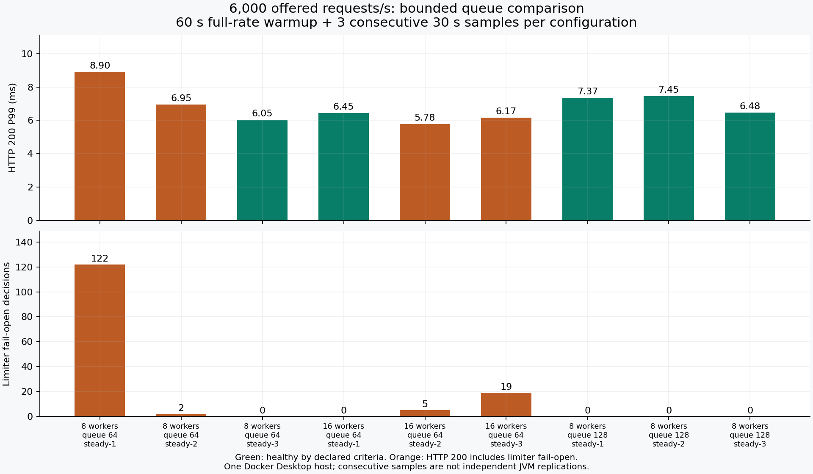
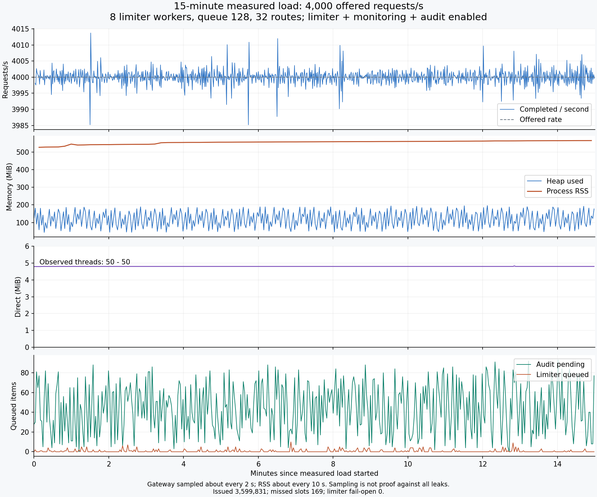

# 当前版本容量、资源稳定性与故障恢复研究

日期：2026-10-04。范围：已完成原子路由发布后的版本，在完整开启限流、监控、审计、熔断的条件下测量容量，定位资源压力，验证一个可撤销的配置调整。原有开发实例未升级。

## 结论和本轮改动

在本机隔离环境中，默认 8 个工作槽位/64 队列的 4000/s 三个短样本健康；可选 8/128 配置在 6000/s 的三个短样本健康，并通过 **4000/s、15 分钟**持续负载：完成 **3,599,831** 次请求，全部 HTTP 200，P95 **2.099 ms**、P99 **3.293 ms**，限流故障放行和审计丢弃/不确定均为 0。漏发 169 个计划槽位，约 **0.0047%**。这提供开发环境下的可复核基线，不构成生产容量承诺。

本轮新增独立发压、实验编排、汇总与绘图入口，以及可选的 `application-capacity.yml`。应用默认限流队列仍为 64，默认 8 个工作槽位不变；可选 profile 只将队列设为 128。六字段运行配置、路由版本与所有存储协议均未变。

冻结的基线 SHA-256 为 `6580adaa99dc42be8f4c99c442c9d56fa7302016389d0ece0c9dc87a9318e670`；新包为 `55e6be5e9888f97a33651732e6823a19caeabac91659e0eb75dbb5dbe615c2cf`。对 JAR 每个条目解压比对，唯一新增项为 `BOOT-INF/classes/application-capacity.yml`，所有共有条目的字节内容一致。开始时保存的 293 个既有文件均未改变。

## 环境与判定标准

- 宿主：Windows，Intel Core i5-13500H，12 物理核心/16 逻辑 CPU，约 31.74 GiB 内存。Docker Desktop Linux VM 为 16 逻辑 CPU，约 15.49 GiB 内存。
- 网关 A 固定逻辑 CPU 4–7，G1，`-Xms256m -Xmx512m`、直接内存上限 256m、容器内存上限 1 GiB；启用 NMT summary。Redis、上游、Redis 故障代理、发压器分别使用其他逻辑 CPU 集合。它们仍共享物理主机和频率调度。
- 32 条路由，轮询请求，小型固定文本响应，HTTP keep-alive；每条路由有独立熔断器。Redis 为单主、无持久化的临时实例。令牌速率和容量设为受支持的 10,000，每次扣 1，以保留限流开销而不主动制造额度不足。
- 固定到达率发压，上限 256 个在途请求，8 秒客户端绝对期限。发不出的计划槽位分别记作调度漏发、在途容量漏发，不偷偷降低目标速率，不为漏发伪造延迟。
- 网关资源约每 2 秒采样，RSS 约每 10 秒采样；发压进程每秒记录 CPU、事件循环延迟、完成数与漏发。原始阶段结果分别保留实际发送、HTTP 200、非 200、传输失败和分状态延迟。

健康标准：全部响应为 HTTP 200，传输错误、限流故障放行、审计丢弃/不确定、对账差、采样错误均为 0，漏发不超过 1%。**HTTP 200 不等于限流健康：资源耗尽后的故障放行也会返回 200。** `summary.passed` 只表示实验执行/断言完成，具体容量必须查看阶段 `assessment.healthy`。

每段测量后等待代理与审计排空，对照入口完成数、监控完成数、审计接收/确认/丢弃/不确定计数。Redis 仅保留最近 5000 条审计，验证保留记录 ID 不重复；累计全量对账依靠确认计数。没有把最近列表长度说成完整持久化历史。

## 原始版本阶梯负载

同一个 JVM，先 1000/s 预热 30 秒；每档测量 30 秒，三轮采用升序、降序、升序。所有档的 HTTP 都为 200，但故障放行使部分档次不健康：

| 目标请求/s | 第 1/2/3 轮漏发数 | 第 1/2/3 轮限流故障放行 | 第 1/2/3 轮 P99，ms | 判断 |
| ---: | --- | --- | --- | --- |
| 2000 | 46 / 0 / 0 | 56 / 0 / 0 | 26.591 / 2.863 / 2.439 | 第一轮受启动/JIT/调度影响，不能隐去 |
| 4000 | 329 / 172 / 287 | 0 / 0 / 0 | 6.011 / 5.043 / 4.787 | 三个短样本健康 |
| 6000 | 529 / 447 / 480 | 5363 / 208 / 16 | 35.455 / 13.423 / 6.455 | 未达到健康标准 |
| 8000 | 1405 / 1115 / 1061 | 11615 / 30739 / 4505 | 31.199 / 26.815 / 18.719 | 未达到健康标准 |

这一阶段体现预热与测量顺序的影响，不能用最后一轮的最好值覆盖前两轮。后面的受控比较统一采用目标速率预热 60 秒，因此与此处不同，不把两者拼成同口径的性能提升百分比。

## JFR 与单变量比较

单独在 6000/s 下执行 60 秒录制：实际成功吞吐约 5238/s，漏发约 12.69%，限流故障放行 15419，P99 108.223 ms。录制结果明显受额外开销/当时主机状态影响，**不参加未录制容量对比**。

JFR 有 4654 个执行样本、17759 个分配样本、173 次 GC；累计 GC 停顿约 0.519 秒，最大一次约 21.2 ms。热点集中于响应式/Netty 调用链、请求头和集合处理，限流工作线程也占有可见的执行样本。录制期间网关 CPU 样本接近 4 个逻辑 CPU 的预算；这些结果不足以认定 GC 是首要瓶颈，也不足以认定某一个框架函数是唯一根因。完整录制和含调用栈归因保留在证据目录。

可直接观察的问题是：较高负载/短时突发会填满限流决策的有界队列，导致本地故障放行。因此先比较可解释、单变量的容量配置，避免凭热点列表改写框架。

所有比较使用同一基线包、32 条路由、6000/s，60 秒目标速率预热后连续三个 30 秒测量；每种配置单独启动 JVM：

| 工作槽位 / 队列 | 第 1/2/3 轮故障放行 | 第 1/2/3 轮 P99，ms | 实际判断 |
| --- | --- | --- | --- |
| 8 / 64 | 122 / 2 / 0 | 8.903 / 6.947 / 6.047 | 默认值偶有本地溢出 |
| 16 / 64 | 0 / 5 / 19 | 6.451 / 5.775 / 6.171 | 不能稳定消除溢出，未采用 |
| 8 / 128 | 0 / 0 / 0 | 7.367 / 7.451 / 6.479 | 三次均达到健康标准，保留为可选配置 |

8/128 三次实际完成 179622、179599、179719 个请求，漏发分别 378、401、281；全部为 200，审计无丢弃/不确定，完整对账相等。这是短样本下改善突发容纳的证据，**没有证明长期健康容量达到 6000/s，也没有证明延迟显著降低**。三次连续窗口不是三次独立 JVM 复现。

取舍：同时准入的限流决策上限从 72 增至 136，排队可能增加等待；8 条连接、500 ms 决策预算与故障放行策略保持不变。新增 profile 是显式选择，不替换应用默认值。随后长期负载与故障实验使用真正打包后的 profile，并从诊断接口断言实际 workers=8、queueCapacity=128。

## 15 分钟持续负载

目标 4000/s，先按相同速率预热 60 秒，随后测量 900 秒。实际成功吞吐 **3999.799/s**；计划 3,600,000，派发并完成 **3,599,831**，调度漏发 169，在途容量漏发 0。HTTP 200 的 P50/P95/P99 为 **1.272 / 2.099 / 3.293 ms**，最大 80.767 ms；包含调度延迟的 P99 为 4.363 ms。

入口完成、监控完成、审计接收和审计确认均为 **3,599,831**；全部 Redis 限流决策确认为 allowed。故障放行、429、非 200、传输错误、审计丢弃/不确定/重试、采样错误及对账差均为 0，结束后 pending=0。

| 资源 | 本轮观察 |
| --- | --- |
| Java 堆 | 约 43.8–195.8 MiB；三个约 5 分钟分段的中位数为 119.1 / 120.3 / 120.0 MiB |
| 堆已提交 | 前后 NMT 均为 256 MiB |
| 直接内存 | 约 4.79–4.83 MiB |
| Java 活跃线程 | 始终 50；不等同于 JVM 全部原生线程 |
| RSS | 526.39 → 564.52 MiB；各分段中位数为 543.14 / 557.52 / 562.64 MiB |
| 审计 | 采样最大 pending=93，保留字节 175,992；配置上限为 20,000 / 16 MiB |
| 限流 | 采样最大排队 10、在途命令 8、定时项 17；诊断累计队列峰值 113 包含预热 |
| GC | 采样累计停顿增量 2.594 秒，GC 计数增量 1941；不是每次请求停顿 |
| CPU | 网关 process_cpu_usage 中位数约 0.474，按本 JVM 4 个逻辑 CPU 预算解释 |

**RSS 没有完全平台化。** 后两个约 5 分钟分段仍各增长约 4–5 MiB。NMT 显示 Code 提交增加约 3.56 MiB、Metaspace 约 1.08 MiB，不能解释全部 RSS 增量，也不能据此把其余增量判定为泄漏。已有证据支持堆、直接内存、线程与队列在本窗口内受控；更长时间的 RSS 走势仍是明确的后续观察项。

采样中的平稳与本轮计数相等只证明该窗口内的行为，不排除其他负载、数小时运行或未观测资源中的泄漏。连接池保留空闲连接是正常复用行为，不能要求结束后 RSS 或连接数回到首次启动值。

## 故障与恢复

使用新包 capacity profile，目标 2000/s，先预热 60 秒。每项故障按预先声明的时间注入和恢复：

| 阶段 | HTTP 200 / 503 / 504 | 限流故障放行 | 审计确认 / 丢弃 / 不确定 |
| --- | --- | ---: | --- |
| 所有 Redis 回复延迟 50 ms（第 10–30 秒，阶段 50 秒） | 99,948 / 0 / 0 | 38,678 | 99,948 / 0 / 0 |
| Redis 断连（第 10–25 秒，阶段 50 秒） | 100,000 / 0 / 0 | 31,118 | 78,211 / 21,746 / 43 |
| 上游等待 2500 ms（第 10–30 秒，阶段 60 秒） | 61,462 / 57,874 / 664 | 0 | 120,000 / 0 / 0 |
| 完全恢复后的 30 秒 | 60,000 / 0 / 0 | 0 | 60,000 / 0 / 0 |

Redis 延迟阶段 HTTP 200 的 P99 为 **483.071 ms**，不能因 HTTP 成功就称为限流健康。断连时 21,746 条审计明确因 `byte_limit` 丢弃，43 条是结果不确定，不能断言这些不确定记录已经丢失或已经落盘。所有阶段最终 pending=0、对账差=0；故障时出现的丢弃不会被恢复阶段抹去。

资源证据：限流采样最大 **8 条在途命令、8 条连接、128 个排队决策、137 个定时项**；审计最大 pending=8593、保留字节 **16,776,752**，未超过 16 MiB。Redis 故障代理的累计最大延迟缓冲为 11,387 字节、定时项 11，overflow=0，没有利用无限故障注入缓冲制造结果。

慢上游期间连接池采样达到 100 条连接和 100 个等待，与配置上限一致；503 原因为熔断拒绝 44,003、连接池满 13,616、连接池等待超时 255；664 个 504 均计为响应头超时。504 的 P99 为 **2021.375 ms**，与 HTTP 200 的 P99 单独报告。

Redis 断连期间运行配置与路由诊断均观察到过期；最终均恢复 ok，限流传输恢复 healthy。最后 30 秒全部健康、P95/P99 为 **1.411 / 2.059 ms**，漏发、故障放行、审计丢弃/不确定及采样错误均为 0。这证明本次故障后恢复，不承诺故障期审计零损失或共享额度仍有效。

## 有负载时的双实例变更

双实例使用共享配置、路由和限流命名空间，审计按实例独立保留。正式窗口 70 秒、目标合计 2000/s，完成 **139,950** 次请求，全部 HTTP 200，P95/P99 为 **1.545 / 2.697 ms**；漏发 50，无传输失败、限流故障放行或审计丢弃/不确定。

| 变更 | A 观察到采用，ms | B 观察到采用，ms |
| --- | ---: | ---: |
| 运行窗口 10 → 12 | 21.938 | 351.511 |
| 一条路由 V1 → V2 | 19.739 | 468.784 |
| 运行窗口 12 → 10 | 10.249 | 341.832 |
| 路由 V2 → V1 | 21.312 | 577.454 |

这些是从提交开始到观察到结果的实测上界，两个实例依次探测，不是精确内部采用耗时或集群一致性承诺。B 在后台同步前继续返回旧版，随后响应体与路由版本头一起切换；原始探测记录保留了这段正常的异步传播过程。

额外 13 次真实路由探测纳入对账：A 69,986，B 69,977，合计 **139,963**，等于负载请求 139,950 + 探测 13。最终两实例窗口都恢复为 10、路由都恢复 V1，诊断为 ok，全部审计确认。所有修改只发生在本轮隔离 Redis 中。

## 验证、证据和复现

后端 `mvn verify` 共 **216 项测试**通过，失败/错误/跳过均为 0。发压器 **4 项测试**通过，覆盖分状态/传输计数、容量漏发、绝对期限、多目标与版本计数。对已有输出目录的保护验证也通过：拒绝复用时不会改写旧 summary 或删除旧 credential。前端未修改，本轮不重复前端与浏览器检查；此前独立故障矩阵保留，未冒称重跑。

共保留 **10 次实验尝试、38 个负载窗口**：1 次在镜像检查阶段退出；其余 9 次执行完成。窗口包含预热、正常负载、故障、恢复和 JFR，不能统称为 38 个健康样本。持续负载、最终恢复窗口和双实例正式变更窗口均达到声明的健康标准。所有本轮容器、网络和真实测试令牌均已清理，JVM 正常关闭；原始证据保留。

可重复操作见 [实验使用说明](../benchmarks/CAPACITY.md)；机器可读证据索引见 [验证索引](backend-capacity-validation-2026-10-04.json)，逐窗口结果见 [精简汇总](backend-capacity-summary-2026-10-04.json)。新工具与旧 benchmark/验收入口并存。本轮证据在 `.dev/capacity-20261004-2l8omgjh/`，包含冻结 JAR、哈希、原始 summary、每秒发压数据、JVM 日志、JFR、源脚本归档和清理记录；`.dev` 被 Git 忽略，交接时需要另行携带该目录。文档图表与精简汇总保存在 docs，单独检出仓库仍能阅读结论。

未隐去的失败/非健康样本：第一轮启动因镜像摘要名称检查失败而退出；所有预热（16-worker 预热包含 2 个 503；双实例预热包含 4 个 503、8 次故障放行）、低预热阶梯中的故障放行、JFR 录制退化及漏发均保留。新包长期测量前 60 秒预热漏发 4848/240000，不计入稳态统计。

## 适用边界与撤销

这是一台开发笔记本、同一个 Docker Desktop VM 内的测量，不是生产规格承诺。未覆盖 HTTPS、大请求体/大响应、长流、高基数客户端 IP、256 条路由极限、跨机器网络、Redis ACL/TLS、持久化丢失、主从切换、硬重启和数小时以上耐久。双实例 A/B 的 CPU 集合大小不同，仅用于一致性验证，不用于横向扩容吞吐比较。健康样本不能外推为故障放行时仍保证共享额度。

profile 不改变存储格式，无需为这个队列设置执行 Redis 迁移；启用/移除 profile 需要重启该实例。真实部署仍须遵守既有配置和路由版本的迁移要求。本轮没有部署、迁移或升级用户开发实例。此前实现、验证文件与证据保留。
