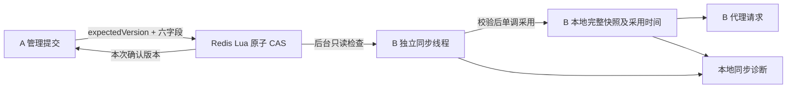

# 多实例运行配置同步

日期：2026-09-27。实现、独立环境验证和兼容回归已完成，提交本轮验收。范围为现有六字段运行配置；不包含路由同步、提交历史、Redis 主从故障切换保证或新配置中心。

## 1. 方案与保证

Redis 继续是唯一权威配置。A 通过原 Lua CAS 保存完整快照后，B 通过后台周期读取取得同一格式的快照，再调用已有的单调采用逻辑。没有增加新的版本协议、配置键或配置写入方。

选择**完成后固定延迟的周期拉取**：这里只有一个小型配置快照，低频读取足以完成可解释、可恢复的同步。未引入通知，也就没有通知丢失、重复或乱序的依赖；每一轮直接读取权威状态，即使错过多个中间版本，下一次成功读取也能追到当时最新版本。本轮不保证逐个采用所有中间版本。



- 代理请求继续读取本地快照；没有增加运行配置 Redis 查询。限流自身原有的 Redis 令牌桶命令仍然存在。
- 每个实例一个专用调度线程、一个周期任务、最多一个同步读取在途。线程内有明确时限的等待，不在网关事件循环中等待 Redis。
- 同步使用独立 Lettuce 连接，应用侧单请求在途，连接队列上限 8（含握手命令），断连拒绝命令且关闭自动重放；失败后丢弃连接，由下一周期新建连接。连接恢复不依赖管理连接的重连节奏。
- 读取调用原 `runtime-config.lua` 的 `read` 模式和共用解码校验，只读取已有配置。缺键、非法快照时不初始化、不修复、不把本地值写回。
- [JDK 固定延迟调度](https://docs.oracle.com/en/java/javase/21/docs/api/java.base/java/util/concurrent/ScheduledExecutorService.html) 在本轮任务完成后再计延迟；[Lettuce 连接选项](https://redis.github.io/lettuce/advanced-usage/client-options/) 用于限制队列和断连行为。并发采用仍由本项目的完整快照 CAS 决定。

## 2. 周期、时限与生命周期

这些是进程启动参数，不属于可在线编辑的六字段配置：

| 参数 | 默认 | 约束 / 作用 |
| --- | ---: | --- |
| `zenith.runtime.sync.enabled` | true | 关闭时保留原启动 / 管理操作采用方式；诊断显示 disabled |
| `zenith.runtime.sync.interval-ms` | 2000 | 100–60000 ms；本轮检查结束至下一轮开始的间隔 |
| `zenith.runtime.sync.timeout-ms` | 1000 | 100–10000 ms；连接与读取共用一个单次预算 |
| `zenith.runtime.sync.stale-after-ms` | 10000 | 至少 interval + timeout，至多 600000 ms；没有新有效确认的过期阈值 |

一次失败不会在当前轮内立即重试，也不积累待执行轮次；等待固定延迟后重试。配置不合法会在启动时被拒绝。

健康条件下的本轮**收敛目标为 3 秒以内**：Redis 可用、单次成功读取通常不超过 250 ms，调度和 JVM 没有超过约 500 ms 的停顿。固定延迟的保守估算要考虑提交发生在旧读取途中：当前读取的剩余时间 + 2 秒延迟 + 下一次读取时间。若只按 1 秒超时预算估计，两次读取加间隔可达约 4 秒，另有调度 / GC 停顿；因此 3 秒是明确条件下的验证目标，不是硬实时上界或生产 SLA。

后台任务在 `ApplicationReadyEvent` 后启动；重复启动事件不会重复注册。原 `ApplicationRunner` 仍须先恢复配置，原 readiness 门禁不变。关闭时禁止新检查和发布，取消 / 中断当前任务，关闭专用连接与客户端，关闭调度器并有界等待其退出；晚到的读取不会在关闭后发布。

**运行期同步失败不主动撤销 readiness。** 网关保留最后有效完整快照并继续服务，诊断暴露失败或过期。现有限流 Redis 故障时的 fail-open 行为也保留；保留限流配置不意味着断连期间可以完成 Redis 限流。其他 Redis 通道的健康状态不由配置同步诊断代替。

## 3. 快照与旧响应

`GatewayRuntimeProperties` 现在用一个原子引用发布不可变 `Adoption(snapshot, adoptedAt)`。快照仍包含版本与全部六字段。版本和采用时间一起读取，避免时间来自另一笔采用。

沿用原采用规则：

1. 同一世代只前进，不采用低版本。
2. 同版本同值不会重新写采用时间。
3. 同版本不同值及跨世代快照拒绝采用。
4. 旧读取晚于管理 PUT 返回时，保留 PUT 已采用的新版本；诊断记录收到的旧确认并显示 `CONFIG_SYNC_OBSERVATION_BEHIND`，下一轮检查恢复。

后台检查和管理更新共享同一采用方法。低版本观察也可能来自外部错误回退，诊断不擅自断言其来源。若持续出现，应检查存储写入方及恢复流程。

## 4. 本地诊断接口

`GET /settings/runtime/sync`，沿用 `/settings/**` 的管理认证与 readiness 保护，返回 `Cache-Control: no-store`。无凭据为 401；能够读取诊断时，即使同步失败也返回 200，具体同步状态看响应内容。该接口不发 Redis 命令。

关键字段：

| 字段 | 含义 |
| --- | --- |
| `source: "local"` | 响应只观察本实例内存 |
| `confirmationScope: "background-read"` | 下述确认字段专指后台读取，不混合启动、管理 GET 或 PUT 的确认 |
| `instanceId` | 本次进程生命周期的随机 UUID；重启后变化，对应 Redis 客户端名 `zenith-runtime-sync:<id>` |
| `adoptedVersion`、`adopted` | 本次诊断读取的本地版本及完整六字段 |
| `lastAdoptedAt` | 最近一次真正前进到新版本的时间，涵盖启动、管理操作和后台采用 |
| `lastConfirmedVersion`、`lastConfirmedAt` | 最近收到且通过存储校验的后台读取版本及收件时间；不是 Redis 提交时间，也不是“此刻最新”证明 |
| `confirmationAgeMs` | 距最近有效后台确认的单调时间间隔；没有确认时为 null |
| `matchesLastConfirmation` | 当前本地完整快照是否与最近后台确认相同，同时比较版本与六字段 |
| `lastCheckOutcome` | none / ok / failed；描述最近完成的检查 |
| `lastCheckStartedAt`、`lastCheckCompletedAt` | 最近检查开始与完成时间 |
| `lastSuccessfulCheckAt` | 最近一次成功确认且读取快照与采用结果一致的时间 |
| `checksStarted`、`checksCompleted`、`failures`、`consecutiveFailures` | 本进程计数，重启后清零 |
| `running`、`checking` | 是否启动同步、是否已有一次检查在进行 |
| `status`、`stale`、`reasonCode`、`reason` | 组合状态、新鲜度和明确原因；周期与预算也随响应返回 |

`lastConfirmedAt` 在同版本检查成功时更新，`lastAdoptedAt` 不更新。管理 PUT 成功后，本地可能领先于最近的后台确认；此时显示 pending / CONFIG_SYNC_LOCAL_CHANGED，等待下一周期。后台确认可能来自不同世代而无法采用，这时确认时间可以是新的，但状态仍为 failed。

| status | 说明 |
| --- | --- |
| pending | 尚无完成的检查，或本地版本已改变、等待下一次后台确认 |
| ok | 最近检查成功、确认未过期，且本地完整快照与最近后台确认一致 |
| failed | 检查读取或采用失败；仍保留上次有效确认和本地快照 |
| stale | 已超过有效确认的新鲜度预算；可以同时保留最近失败原因 |
| disabled | 配置关闭同步 |
| stopped | 生命周期已停止；用于关闭阶段本地状态检查，不保证此时 HTTP 服务仍开放 |

失败原因包括：`CONFIG_SYNC_READ_FAILED`、`CONFIG_STORAGE_MISSING`、`CONFIG_STORAGE_INVALID`、`CONFIG_SYNC_GENERATION_CHANGED`、`CONFIG_SYNC_VERSION_CONTENT_MISMATCH`、`CONFIG_SYNC_OBSERVATION_BEHIND`。时间过期使用 `CONFIG_SYNC_CONFIRMATION_EXPIRED`。

读取失败不会把本地版本包装成一次新 Redis 确认。`ok` 只描述这次观察到的关系，**不代表此刻整个集群一致**。新鲜度由单调时钟判断，展示时间使用 UTC 墙上时钟；时钟跳变不改变过期判断。

```powershell
$headers = @{ Authorization = "Bearer $env:ZENITH_ADMIN_TOKEN" }
Invoke-RestMethod 'http://127.0.0.1:8080/settings/runtime/sync' -Headers $headers
```

## 5. 一次保存成功究竟保证什么

原 PUT 协议不变。200 的主快照仍是这次 Lua CAS 确认的版本与有效值，`adopted` 仍单独表示响应形成时该实例采用的完整快照。它不保证其他实例都已采用，也不保证客户端稍后读取仍是该版本。

Redis 或 HTTP 回复丢失时，既有 unknown / committed / not-written 区分保留。后台后来读到相同值或更高版本，只能确认那次读取的存储状态，不能证明原请求是否执行、是谁提交了版本，也不会自动重发草稿。前端无需新增业务逻辑，继续使用原 expectedVersion、冲突核对与待核对基准。

存储 schema、版本编码、六字段接口均不变。可以通过启动参数禁用同步；回退到上一轮已验收的**带版本保护**网关不需要改写 Redis JSON。更早的无版本写入方仍不能混跑。

## 6. 故障和受控恢复

缺键、非法内容、未知 schema、同版本不同值和世代变化都不会触发后台写入。诊断暴露原因，当前实例继续保留原完整快照。

普通连接故障恢复后，下一次读取自动采用较新合法版本。真实的数据恢复仍遵循[原存储迁移和回退流程](backend-config-consistency.md)：停止相关写入方、核对备份、明确世代并受控重启。测试中的损坏注入撤销会恢复原始字节、原世代和版本，用来验证错误消除后检查能继续；这不是在线自动重建或跨世代采用方案。

同步连接与已有管理 / 限流连接相互独立。实测发现管理连接可能仍处于自身的重连退避，此时同步连接已经正常。诊断不会把同步恢复扩大解释成整个 Redis 依赖恢复。

## 7. 可重复验证和实际结果

入口：`node verification/config-sync-live.mjs`。

前置条件：JDK 21、Node 24、已启动的 Docker、缓存的项目固定 Redis 7.4.11 镜像，以及当前 `backend/target/zg-1.0.0.jar`。在仓库根目录执行；脚本不复用现有开发 Redis 或网关。

脚本自建独立 Redis、随机端口、两个真实 JVM、B 专用 RESP 故障代理和 HTTP 上游。只在 A 通过管理 GET 建立初始提交基准；B 的观察仅使用 adopted / sync 本地接口。旧响应场景有一次有意在 B 进行的 PUT，以便在被扣留读取返回前产生较新的本地采用。不会通过 B 的管理配置 GET 推动同步。

**最终 10 组全部通过**：

- A 提交后 B 自动采用；真实代理请求从 200 改为 429（容量 1、单次消耗 2），证明限流采用的是新配置。
- 同版本重复检查更新确认时间，采用时间保持不变。
- 扣留一轮背景读取期间，20 次业务代理请求和 10 次本地观察增加 **0 条**运行配置 Redis 命令。
- 只切断 B；A 提交三个新版本。B 保留原版本，先 failed、后 stale，恢复后自动追到最新版本。
- 扣留真实 Redis 旧回复，随后 A、B 提交新版本，再释放旧回复。B 版本与采用时间不回退，下次正常检查恢复。
- 四波连续提交共 12 次，观察到的快照始终对应真实提交账本中的完整版本。
- 缺键、格式损坏、换世代、同版本改内容均暴露原因，不写回存储、不污染本地快照；撤销故障后继续正常检查。
- B 重启恢复最新存储版本，实例标识变化，再次提交后仍自动跟随。
- 同步读取进行中关闭 B；进程正常退出，代理连接数为 0，对应 Redis 命名连接已移除。
- 全程记录 927 次本地观察，B 的 Redis 配置 GET 调用为 **0**，所有观察到的发布快照与提交账本一致；故障代理峰值连接数为 2。

时间均来自本次隔离环境实际记录；普通传播从提交确认计时，恢复从解除断连计时。观测时间还包含最多一轮 40 ms 的测试轮询间隔：

| 场景 | B 观测到采用且检查正常 |
| --- | ---: |
| 首次 A → B | 1566.6 ms |
| 四波连续更新 | 1951.6 / 2007.4 / 2003.1 / 1957.0 ms |
| 断连后恢复到最新版本 | 58.7 ms |
| B 重启后的后续更新 | 2011.3 ms |

本次所有健康条件下样本均达到 3 秒目标。恢复的 58.7 ms 恰好接近下一轮检查时点，不是固定恢复时延承诺。对应管理连接约 1160 ms 才观察到重新握手，进一步说明诊断边界。中间版本可以被跳过：本次 B 从 3 追到 6，连续更新采用 11、14、17、20，重启恢复 21 后继续跟随 22。

机器可读证据：[双实例报告](backend-config-sync-validation.json)。本机完整命令帧、管理请求记录、每个 JVM 日志位于 `.dev/config-sync/live-a9c337477a/`。文件包含提交确认、采用、失败、过期、恢复的 UTC 时间和实际版本。

## 8. 回归、清理和取舍

- 后端完整 `verify`：**113 项，0 失败、0 错误、0 跳过**，使用本轮独立 Redis；生产 JAR 打包成功。新增 10 项同步单元测试、1 项真实读取集成测试，并扩展原 readiness 生命周期测试。
- 加强墙上时钟向前 / 向后跳变的用例后，同步 10 项再次通过；确认过期只受单调时间影响。原完整快照并发屏障和旧回调测试继续通过。
- 前端 **57 项**测试、类型检查和生产构建通过。既有 ECharts 延迟加载块仍有超过 500 kB 提示。
- 当前后端开启自动同步时，原冲突、重读、认证恢复、草稿保护的 **6 组真实浏览器回归**通过，结果在 `.dev/config-sync/browser-regression/`；截图写入本轮独立目录，上一轮验收证据保留。
- 旧 `config-consistency-live.mjs` 的“手动读取确认”故障矩阵显式关闭自动同步，保留其原测试前提；本轮未重跑该旧 20 组矩阵，也不覆盖原证据。本轮同步由新双实例入口验证。
- 首次试跑暴露了测试前置条件：后台已恢复不代表原管理连接已经完成重连。后续用 RESP 握手作为明确条件。另修复了故障注入器清理时重复释放已扣留回复的问题，避免制造协议回复错位。失败试跑记录仍保留在本轮 `.dev/config-sync/`，没有作为通过证据。
- 验证进程均正常退出；本轮自建 Redis 容器、代理、上游、浏览器和预览服务均已清理。管理凭据只在测试进程内存中使用。现有开发实例未升级。

仍未覆盖：大量实例的同步相位集中、跨主机时钟偏差与长 GC、高延迟或不稳定网络下的长期负载、TLS / 特殊 Redis 部署、Sentinel / Cluster / 复制回退。默认约每实例每两秒一次小型读取，规模化运维还需评估轮询成本和抖动策略。单 Redis 的 CAS 与单调本地采用不能推导出故障切换持久性，也不提供集群原子切换；持续更新期间没有一个“所有实例此刻一致”的全局承诺。
