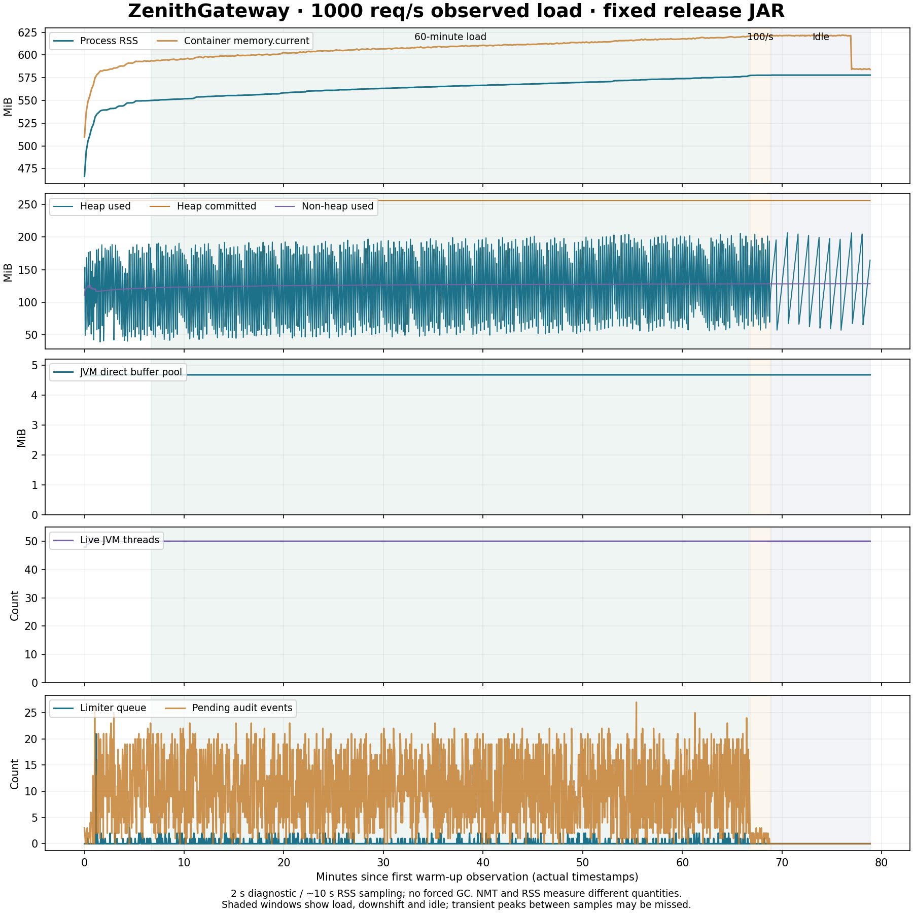

# 最终发布包的保守容量基线

2026-10-07。本轮使用远端最终提交 `8a654cbcf1c31d9754bfdd2db7f699613ceedfbb` 的实际 CI JAR，在下述单实例资源与负载条件下完成 **1000 req/s 计划到达率、连续 3600 秒** 的健康窗口。实际完成 **3,599,757** 个 HTTP 200，成功吞吐 **999.93 req/s**。这不是最大容量，也不是任意部署环境的承诺。此前 **4000 req/s 一小时未通过** 的结论不变；结果交接继续关闭。

发布与构建身份见[发布收尾](release-closeout-2026-10-07.md)。实验入口：[运行说明](../benchmarks/CONSERVATIVE-CAPACITY.md)、`benchmarks/conservative-capacity.mjs`。原始证据目录为 `.dev/capacity-baseline-20261007-3e81767a/experiment-01/`。本轮没有修改后端业务源码或升级开发实例。

## 固定条件和门槛

| 项目 | 实际条件 |
| --- | --- |
| 机器 | Intel Core i5-13500H，Windows 10.0.26200，宿主 16 个逻辑 CPU / 约 31.7 GiB 内存；Docker Linux VM 16 个逻辑 CPU / 约 15.5 GiB |
| 网关 | 一个独立 JVM，cpuset 4–7，1 GiB 容器上限、512 PIDs；不是独占物理核心 |
| JVM | 固定摘要 Microsoft JDK 21 镜像；G1，Xms 256 MiB / Xmx 512 MiB，MaxDirectMemorySize 256 MiB，ActiveProcessorCount 4，NMT summary |
| 其他资源 | Redis cpuset 0–1 / 256 MiB；上游 2–3 / 256 MiB；发生器 8–11 / 512 MiB，最多 256 个在途请求 |
| 限流 | `capacity` profile：8 个工作线程、128 个排队名额，决策预算 500 ms；交接 false；本地与 Redis 故障策略均 allow |
| 额度 | 10000 tokens/s、容量 10000、成本 1；正常场景额度充足，限流没有关闭 |
| 业务 | 32 条路由，同一个 HTTP 上游；GET、小文本响应、keep-alive，无 TLS。熔断、监控与审计均开启 |
| 存储 | 本轮专属单 Redis，无 RDB/AOF，不代表持久化或主从切换场景 |
| 产物 | JAR SHA256 `aed33ee043618930ffa3a0a45eccab75b95737d6a760e50f66f671f365a24dd1` |

所有镜像摘要、容器实际限制、启动参数、采用版本、发生器配置与工具源码哈希均存入 `summary.json`；首次流量前写入 `plan.json` 并复制工具源码。没有在中途调参、更换包、降低门槛、执行 Full GC 或 native heap trim。

健康条件预先固定：全部已发请求为 200、零传输错误、故障放行/保护性拒绝/扣费未知/取消/显式绕过为零；允许、转发、扣费确认、最终完成、上游接收、审计收到与确认逐阶段一致。发生器缺口 ≤1%，P95 ≤50 ms，P99 ≤100 ms，从计划到达计时的 P99 ≤150 ms。采样失败、计数器重置、配置变化或资源越界也会失败。计数器的 unknown 是独立维度，不能加进总请求数。

## 实际窗口

| 阶段 | 已发 / 全部 200 | 到达缺口 | P95 / P99 | 判定 |
| --- | ---: | ---: | ---: | --- |
| 预热：100/s 30 秒 → 500/s 30 秒 → 1000/s 60 秒 | 77,749 | 251 / 78,000（0.322%） | 19.039 / 45.919 ms | 通过；预热单独统计 |
| 短测 1：1000/s，120 秒 | 119,994 | 6 / 120,000 | 4.383 / 6.791 ms | 通过 |
| 短测 2：1000/s，120 秒 | 119,999 | 1 / 120,000 | 3.039 / 4.215 ms | 通过 |
| 入场确认：1000/s，30 秒 | 29,999 | 1 / 30,000 | 3.743 / 4.927 ms | 通过 |
| 一小时：1000/s，3600 秒 | 3,599,757 | 243 / 3,600,000（0.00675%） | 3.579 / 5.039 ms | 全部门槛通过 |
| 降载：100/s，120 秒 | 12,000 | 0 / 12,000 | 4.135 / 4.571 ms | 通过 |

两次短测通过后还执行了 30 秒入场确认，避免内存检查点造成的间隔直接进入长测；其完整结果在验证 JSON 中。建路由后的转发探测与所有预热流量都不混入一小时的分母。

一小时成功响应 P50 1.478 ms、P95 3.579 ms、P99 5.039 ms、最大 118.463 ms；从计划到达开始的 P99 7.163 ms、最大 121.279 ms。所有 3,599,757 个已发请求与上游接收、完成统计、额度确认和审计确认一致，故障放行、保护性拒绝、额度拒绝、扣费未知、取消、审计丢弃、审计未知均为 0。到达缺口明确计入报告，不能说实际发出了整整 360 万个请求。

一小时采样峰值：限流在途命令 6、排队 3、保留任务 11；代理连接 60、代理等待 1；审计待写 27；线程 50。采样峰值不能证明采样间隙没有更高瞬时峰值，限流器自身累计峰值与原始采样同时保留。所有定期采样值处于声明上限内，饱和事件没有截断或游标遗漏；累计命令峰值的例外见下文。

**累计命令峰值另有口径限制。** 预热将自启动 `peakCommandsInFlight` 从 1 推到 9，之后所有窗口一直为 9；累计排队峰值 60 也全部来自预热。本轮 1732 个长测定期样本满足既定资源门槛，但不能用样本值 6 抹去这个 9，更不能将它直接解释为 9 个 Redis 正在执行的命令。

最终包的受控回调夹具复现了计数退休窗口：`Command.observed()` 的 CAS 已将 waiting 置 false，回调暂停在全局 `inFlight` 扣减之前；另一观察者的 CAS 失败并返回，同一工作线程可开始下一次命令。在仅 1 个 waiting 标志为 true 时，全局计数与累计峰值均可为 2，回调继续后最终回到 0。使用的是从最终 JAR 提取的原始类，Mockito 只在诊断 `enabled()` 调用处建立屏障；没有真实 Redis 流量，也没有修改产品类。源码与结果在 `counter-fixture/CommandCounterRace.java`、`counter-fixture/result.log`。它证明这一诊断可短暂高估，不能唯一归因预热中具体哪次调度；没有额外捕捉那一瞬间的命令执行轨迹。

因此本轮结论是“一小时实际 HTTP、决策、延迟、对账和预设定期采样门槛通过”，**不是已精确实测每一瞬间的物理命令上限**。计数器线性化需要后续单独修正；本轮保持冻结包，不追改计数器或重写原实验门槛。

全部代理响应都携带同一路由采用版本 `55b8802e-8a4e-4292-9b27-51b800b8f801:33`。运行配置与路由在本轮保持不变，没有使用管理读取刷新来掩盖变更或重启。

## 内存观察与取舍

一小时 RSS 采样从 **549.96 → 577.09 MiB**，增加 **27.13 MiB**；前后五分钟中位数为 551.34 / 575.46 MiB。末二十分钟拟合仍约 **+0.397 MiB/分钟**，因此 **尚未观察到 RSS 平台**。这与“容量窗口通过”是两个结论，不能合并成“内存长期稳定已证明”。

同一批 RSS 采样点的堆使用量在约 45–203 MiB 之间波动，JVM direct buffer pool 一直约 4.674 MiB，线程数一直为 50；非堆使用量由约 122.22 增至 128.28 MiB。NMT 检查点的 committed 合计增加约 13.45 MiB，其中 Object Monitors +7.93 MiB、Code +3.36 MiB、Metaspace +0.77 MiB。NMT committed 与 RSS 不同义；这些分项不能相加后声称已解释全部物理驻留内存增长。

10 分钟空闲中，RSS 约 577.71–577.84 MiB，前后五分钟中位数均为 577.84 MiB；没有恢复到长测开始的水平。最终阶段外检查点为 578.48 MiB，NMT committed 已降到 493.84 MiB、Object Monitors 降到 0，但 RSS 没有同比回落。堆仍有正常 GC 波动，直接缓冲池与线程数保持不变。容器 `memory.current` 在空闲末段下降，与进程 RSS 是不同统计；不能把它画成“JVM RSS 已回收”。原始 memory.stat 分项也保留。

本轮不会据此诊断泄漏，也不调整分配器、GC 或资源上限。此前约 34 MiB 增长来自另一负载及构建记录，本轮只能提供可比较的观察方法，不能当作单变量归因实验。**仍值得保留 RSS 归因为独立专项**；当前证据已经将“堆/直接缓冲池/线程持续增长”与“RSS 在负载中缓慢增长、停流后保持高位”区分开。

## 证据和复验范围

完整 `summary.json` 保存每阶段前后计数、约 2 秒诊断/Prometheus 采样、约 10 秒 RSS/cgroup 采样、Redis commandstats、最近慢日志、发生器每秒统计及有界失败样本。GC/safepoint 日志与阶段外 NMT、heap_info、codecache、smaps 另存。审计 Redis List 最多保留最近 5000 条，整场对账使用累计确认计数；没有声称保留数百万条逐请求历史。

本轮实际执行最终提交的 Verify 与 Rolling replacement：252 项后端、107 项前端、61 项工具测试、183 项监控断言及生产构建；6 组真实滚动场景通过。新容量判定与发生器检查另行执行，并纳入统一工具测试清单。旧配置、代理、限流和浏览器的完整专项矩阵没有在本机机械重跑；本轮未改业务代码，其历史记录保留。

本机最终 **71 项工具测试全部通过**，其中新增 10 项容量门槛测试；另有 1 组上述原包回调夹具，不计入 71。前后端生产构建来自实际远端 CI，没有用本地重打包替换实测 JAR。

## 退出、清理和环境差异

降载和空闲后，代理连接为 0，全部 136 个准入名额归还，保留任务、审计 pending、审计 reservedBytes 均为 0。全程包含转发探测、预热、短测、确认、长测、降载共 **3,959,499** 次审计收到与确认一致，丢弃、未知和重试均为 0。网关通过认证 shutdown 正常退出，Docker die 事件确认退出码 **0**。随后清理夹具上游与专属 Redis（清理时强制移除的 137 不属于业务失败），并删除所有本轮容器、匿名卷、网络和凭据。

独立清单复核确认：既有 6 个容器的 ID/状态和 168 个卷保留，无本轮容器、网络或匿名卷残留。Docker Desktop 原本就在运行，结束后保持运行；开发实例没有升级。

**默认 bridge 再次发生环境变化，未归因。** 运行前 ID `f43230b491b488135ceaae68edaee794837e0a53527561468401415eab31553b`，运行后为 `53c8672d26fbd2c9589ce8bfc90a090c9d650d884a519f82ea2aca8e9061daeb`，后者创建时间为 `2026-10-07T09:38:42.656400799Z`。实际实验使用自建网络，报告没有删除或修改默认 bridge；不能因为自建资源清理成功就宣称宿主网络环境完全未变。前后清单及容器退出事件在证据根目录保留。

机器可读汇总：[验证结果](backend-conservative-capacity-validation.json)。它关联最终产物、各窗口、内存结果、诊断限制、工具测试及清理原始证据；按该记录验收，不把成功的 HTTP 容量窗口当成所有未决问题已解决。

2026-10-07 验收工具的两项 P2 已补修，见[定向补验记录](backend-conservative-capacity-p2.md)与[补验 JSON](backend-conservative-capacity-p2-validation.json)。加强后的门禁只读重算原始 6 个窗口，均通过；原始数据、归档工具和上面的历史验证 JSON 保持原样。本轮未重复一小时压测，退出码补验使用独立容器，不能与原始网关退出证据混为一次实验。

本次单个健康小时不是多次重启重复长测、最大容量、生产 SLO、云负载均衡入口容量或多日内存稳定性证明。磁盘持久化、远端 Redis、真实业务延迟、大响应、TLS、多实例竞争与宿主其他负载都需要独立验证。现有 4000/s 失败样本继续有效，不能从 1000/s 的通过推算上限。
