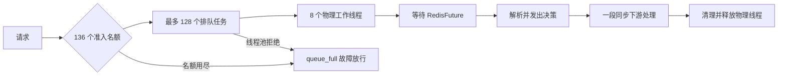
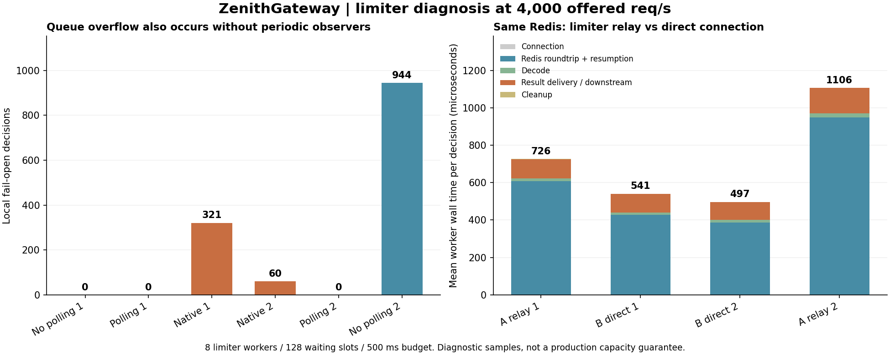

# ZenithGateway：限流短时饱和定位

日期：2026-10-04。本轮完成诊断，没有部署或修改正式后端/前端源码。

**直接触发机制已确认：限流工作线程被端到端往返和同步结果处理占用，瞬时积压填满有限队列，随后按既定策略放行。新增实测的 6,153 次故障放行全部为 `queue_full`，不是等到 500ms 决策超时才放行。** 关闭周期性诊断、限流绕过实验中继，均仍可复现。没有证据把全部尾延迟唯一归到某个 Redis、Lettuce 或操作系统缺陷。

11 个主要负载阶段和 8 个预热阶段共 8,508,391 个实际请求，全部 HTTP 200，但并非全部经过成功的额度判断。故障放行中 4,510 次来自准入名额耗尽，1,643 次来自线程池拒绝；没有 Redis 故障放行、429、传输错误或审计对账差异。全部原始失败样本保留，HTTP 200 不代表健康容量通过。

## 1. 具体代码路径

- [准入上限](D:/Java/ZenithGateway/backend/src/main/java/com/zch/ratelimit/RedisRateLimiter.java:99)：8 个工作线程加 128 个队列位，共 136 个决策名额；拿不到名额立即记录本地放行。
- [实际入队](D:/Java/ZenithGateway/backend/src/main/java/com/zch/ratelimit/RedisRateLimiter.java:103)：线程池也有独立的 128 位有界队列，满载时拒绝。准入名额在逻辑决策完成时释放，物理工作线程此时可能仍在执行结果消费者，所以两个拒绝入口都必须统计。JDK 的有界队列与拒绝语义见[官方说明](https://docs.oracle.com/en/java/javase/21/docs/api/java.base/java/util/concurrent/ThreadPoolExecutor.html)。
- [同步等待](D:/Java/ZenithGateway/backend/src/main/java/com/zch/ratelimit/RedisRateLimiter.java:165)：每个任务等待一个 RedisFuture，等待期间占住一个物理工作线程/连接槽。
- [结果发出](D:/Java/ZenithGateway/backend/src/main/java/com/zch/ratelimit/RedisRateLimiter.java:168)：`sink.success` 继续执行一段同步的代理过滤器订阅和准备工作，之后才退出任务。这不等于占住线程等待整段 HTTP 响应完成。
- [计数回落](D:/Java/ZenithGateway/backend/src/main/java/com/zch/ratelimit/RedisRateLimiter.java:180)：`commandsInFlight` 在上述同步后续处理后才递减，不能直接解释成 Redis 服务器仍未完成的命令数。

在 4,000 req/s 下，128 个等待位只相当于约 32ms 的计划到达量；这只是量级说明，真实到达有突发、处理仍并行进行。当前结构对多个工作线程同时变慢比较敏感，平均耗时和平均 CPU 不能替代尾延迟观察。

## 2. 周期性诊断并不是必要触发条件

固定 8 / 128 / 500ms、32 条路由和 4,000 req/s；同一 JVM 按无轮询→常规轮询→原生诊断→原生诊断→常规轮询→无轮询执行，各 180 秒。单独保留前面的 30 秒 1,000 req/s 与 60 秒目标负载预热。

| 阶段 | 实际请求 | queue_full | HTTP P99 / ms |
| --- | ---: | ---: | ---: |
| 01-none | 719,702 | 0 | 5.647 |
| 02-light | 719,798 | 0 | 3.891 |
| 03-native | 719,652 | 321 | 9.839 |
| 04-native | 719,264 | 60 | 14.927 |
| 05-light | 719,855 | 0 | 4.167 |
| 06-none | 719,108 | 944 | 13.455 |

`none` 表示负载中不轮询管理接口、不读取进程状态、不执行 jcmd；仍保留统一的进程内计数、GC 日志、客户端采样和宿主报告保存，不等于零观测。`native` 在常规采集上每 60 秒执行原生内存诊断，频率高于原稳定性实验的每 300 秒。

两轮原生诊断阶段出现 381 次放行，最后一轮关闭周期性采集仍出现 944 次。因此不能把删除诊断当成修复。原一小时的 23,037 次放行分布在 70 个两秒级观测窗中，仅 1 个窗口与原生诊断时间重叠；时间重叠也不等于因果。

## 3. 实验中继有成本，直连也不是充分修复

A 的限流连接经 Node TCP 故障注入中继；B 仅把限流连接改为直连同一 Redis。配置、路由、审计的 Redis 路径不变。两个 JVM 均使用 CPU 4–7，一次只给其中一个发负载，按 A→B→B→A 执行；Redis CLIENT LIST 核实两边各 8 条连接的实际来源。

| 阶段 | 实际请求 | queue_full | 平均 Redis 往返及恢复 / μs | 平均结果发出及同步后续 / μs |
| --- | ---: | ---: | ---: | ---: |
| 01-A-relay | 479,521 | 163 | 607.20 | 103.94 |
| 02-B-direct | 478,815 | 43 | 427.50 | 99.04 |
| 03-B-direct | 479,757 | 0 | 387.30 | 95.89 |
| 04-A-relay | 475,661 | 4,257 | 948.63 | 136.28 |

本组中直连的平均等待较低，但仍出现 43 次放行。不同实例的预热程度、连接空闲和共享宿主调度会影响结果，特别是实例切换后上游连接池可能已空闲回收；不能把这四个计数差异当作纯中继因果比例，也不能宣称去掉中继后容量已经通过。B 的 1,000 req/s 预热还出现 6 次本地放行，证据中未删除。

图中右侧是实际执行了限流任务的平均墙钟占用，包含等待，不能当成 CPU 时间。

## 4. 等待进一步分到了哪里

最后增加一轮单实例限流直连实验，在相同资源下预热后测量 300 秒：**1,198,581 个请求，359 次 queue_full**。平均连接阶段 0.60μs，Redis 往返及恢复 417.37μs，解析 14.13μs，结果发出及同步后续 99.78μs。持续建立新连接不是本组主要等待。

11 个主要阶段保留的饱和快照共包含 656 个工作线程观测，其中 616 个处在 Redis 往返及恢复阶段。这是受限、非原子的现场采样，不是所有请求的耗时份额。

最后一轮额外使用单调时钟记录发送、RedisFuture 回调与 get 返回，并读取 Lua 原本返回的 Redis 毫秒时间。保留了 21 条超过 10ms 的抽样往返：

| UTC 时间 | 总往返 / ms | 发送到 Redis 时间点 / ms | Redis 时间点到 get 返回 / ms | 回调到 get 返回 / ms |
| --- | ---: | ---: | ---: | ---: |
| 2026-10-04T11:31:07.297Z | 37.414 | 0 | 37 | 0.016 |
| 2026-10-04T11:31:07.435Z | 12.785 | 4 | 9 | 7.789 |

两条选例的回调都由 Lettuce I/O 线程执行。第一条显示：Lua 已记录 Redis 时间后，到客户端完成响应处理仍有长尾；第二条显示：回调已到达，工作线程恢复仍可再等约 7.79ms。还有其他样本主要慢在 Redis 时间点之前，因此不能只归因于回复一侧。

**边界不能省略：** Redis 时间点不等于整条命令完成时刻；到客户端回调的区间仍含服务器后续执行/回包、网络与 Lettuce 处理。两进程同处一个 Docker VM，墙钟分段有毫秒取整误差。某些回调在线程名为 `rate-limit-io` 的工作线程上同步执行，意味着注册时可能已完成，此时回调不能视为网络到达标记，以上例子已排除这类情况。未观测到早于 get 返回的回调单独计数，未强行补成零延迟。

Redis 所有 EVAL 的本段均值为 42.67μs（包括审计等脚本），但慢日志也确实记录了限流命令最长 8.766ms。保留的慢日志 ID 为 0–86、共 87 条，没有触及 128 条保留上限。**不能因此宣称 Redis 端没有尾延迟，或把端到端等待全部算成 Lua 执行。** [INFO 指标定义](https://redis.io/docs/latest/commands/info/)与[慢日志范围](https://redis.io/docs/latest/commands/slowlog-get/)区分了命令执行和客户端 I/O。

本轮已定位到“端到端往返与调度尾延迟 → 有限物理并发占用 → 本地队列拒绝”的机制；尚未进一步区分每一次尾延迟中的内核网络、Redis 服务器调度与 Lettuce 事件循环份额。共享宿主条件下，不把未测量部分写成某个库的确定缺陷。

## 5. 同步后续处理与指标口径已经有确定性复现

`WorkerOccupancyTest` 使用未改动的正式限流源码副本，模拟 RedisFuture 已立即成功，只用锁存器暂停结果消费者。测试确认：逻辑决策名额已释放，物理工作线程仍占用，`commandsInFlight` 仍为 1；后续排队满时出现 `queue_full`；释放消费者后恢复。**1 项测试通过，0 失败、0 跳过。** 这是机制证明，不是人为暂停可以代表自然工作负载的证明。

前一轮 6,000 req/s JFR 的限流线程执行采样中，有 1,117 / 1,387 个处于结果发出及下游过滤器调用链，证实实际网关也存在这段同步链；这不是墙钟耗时占比，不能直接推断它是本轮主要瓶颈。Reactor 的默认线程传播行为见[官方说明](https://projectreactor.io/docs/core/release/reference/coreFeatures/schedulers.html)。

## 6. 下一步应改什么

1. 先把固定原因计数、两个拒绝入口、真正尚未收到 Redis 回复的命令数、物理工作线程忙碌数分别纳入正式诊断；补上有界分段耗时。当前最近一次结果会覆盖故障、在途指标混入下游处理，是已验证的可观测性缺口。
2. 对同步结果分发占用做单独的有界交接对照，明确交接容量、取消与停机语义；不要直接增加一个无界调度队列。此次没有证据保证仅移动下游执行就会消除所有放行。
3. 用保持 8 / 128 / 500ms 的直连基线做前后对比，并在候选改动成立后重跑完整一小时。故障中继实验单列。增加队列、线程或把故障放行算作成功不能替代健康判据。

本轮没有更改放行策略、Lua、线程数、队列或正式页面；4,000 req/s 的长期健康容量仍未获确认。

## 7. 验证、保留与复现

- 19 个完整阶段对账、8,508,391 个请求、6,153 次队列满均有原因计数；监控完成数与审计收到/确认数一致，无丢弃、未知、重试或对账缺口。
- 39 项独立证据完整性检查通过；这不表示所有性能阶段健康。
- 运行前记录的 543 个既有文件哈希一致，6 个既有容器 ID 和状态一致，前一轮 270 份原始证据哈希一致。本轮容器、网络和凭证均已清理。
- 正式应用源码未修改；未重跑既有后端全量、前端和完整故障矩阵。三个诊断包独立构建，正式源码副本的机制测试通过。
- 每类现场详情保留上限 128 条、最短间隔 100ms；原因计数完整，详情为抽样。没有新增逐请求配置查询。诊断有自身成本，不能直接拿诊断包宣称生产吞吐量提升。

入口：[复现说明](../benchmarks/LIMITER-DIAGNOSIS.md) · [机器可读摘要](backend-limiter-diagnosis-summary-2026-10-04.json) · [验证与证据索引](backend-limiter-diagnosis-validation-2026-10-04.json)。

原始证据目录：`D:/Java/ZenithGateway/.dev/limiter-diagnosis-20261004-6337c56a`。冻结包、每轮实际工具源码、完整阶段前后快照、负载输出、GC/慢日志、机制测试与历史保留核验均在其中；该目录受 Git 忽略，转交时应连同索引中所指证据一起保留。
