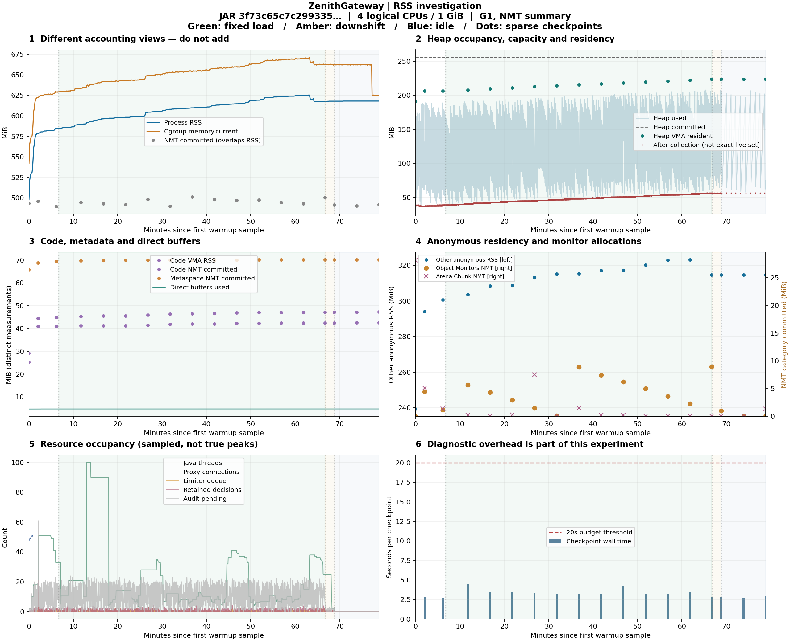
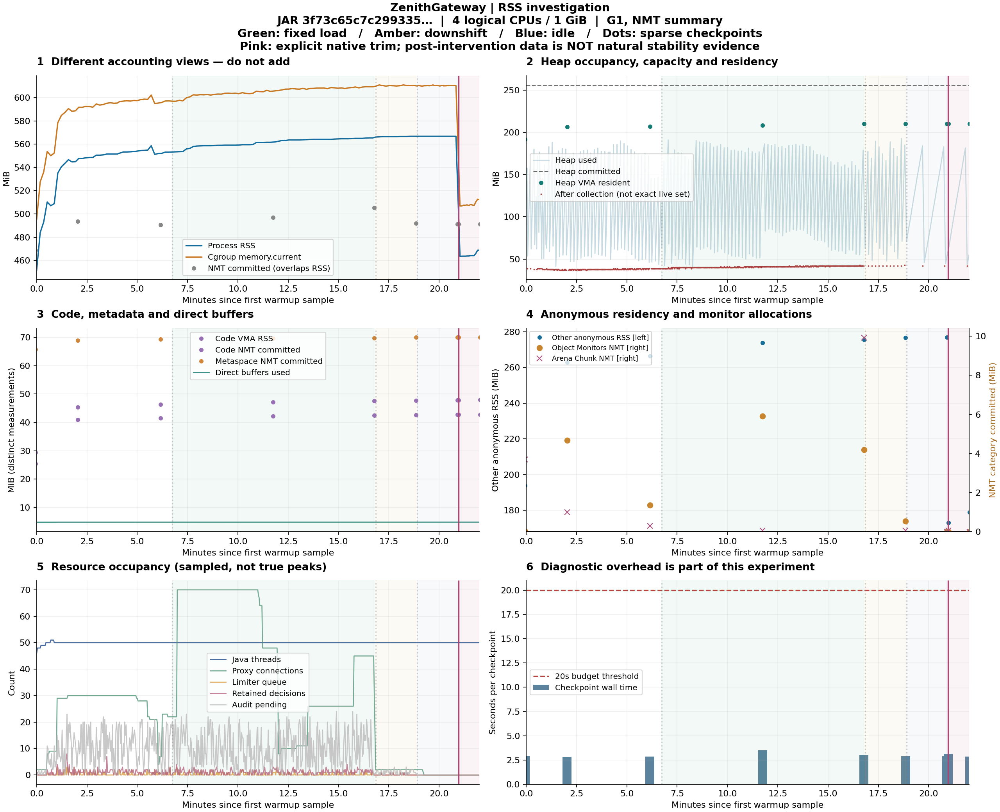

# 持续负载 RSS 调查与固定修复包验证

2026-10-07；本轮只扩展实验、采集、分析和工具回归，未修改后端、前端或开发实例。

**容量与内存是两个结论。** 指定修复包在单实例、4 个逻辑 CPU、1 GiB、1000 req/s × 3600 秒的既定条件下通过健康门禁；RSS 在正式窗口从 584.98 增至 617.73 MiB，仍未通过预声明的平台筛查。证据能将增长分到 Java 堆驻留页、其他匿名映射和代码缓存，不能因此宣布长期稳定或认定泄漏。历史 4000 req/s 一小时失败结论保持不变。

## 身份、范围与复验入口

使用已独立验收的归档 JAR，运行前后核对 SHA256：

```text
.dev/limiter-command-counter-20261007-79dc12b4/artifacts/gateway.jar
3f73c65c7c29933549878c570a6b5a8b7bd8bafad2e5333603eee1de089da838
```

工作区 HEAD 为 `8dded422930d93a0810e4641e51e6f327fad62d6`，存在之前的未提交改动，不能只用该提交代表运行产物。122 个后端构建输入与该 JAR 的归档清单逐一相符；源码清单哈希为 `cab9dc25c0d421cc834f28b5b2a9f939a2704a70086e0289fec148323f6d00f0`。原一小时旧包哈希以 `aed33ee0` 开头，其结论与新包分开记录。

新证据根目录：`.dev/rss-investigation-20261007-f368c696`。`experiment-plan.json` 在第一轮前固定条件；`native-experiment-plan.json` 在第一轮完成后、第二轮启动前固定假设与一次干预。每轮复制执行工具、记录镜像摘要及容器实际配置。机器可读身份、证据索引、退出和清理见 [validation](backend-rss-investigation-validation.json)。旧证据只读，分析写入新目录。

可重复入口仍为 [conservative-capacity.mjs](../benchmarks/conservative-capacity.mjs)，使用显式 `CAPACITY_BASELINE_MODE=rss-investigation`；不设置模式时保留原容量流程，计数专项短模式也保留。命令和前置条件见 [工具说明](../benchmarks/CONSERVATIVE-CAPACITY.md)。`rss-report.mjs` 只读原始证据，拒绝覆盖已有分析目录；`rss-plot.py` 生成独立 PNG/SVG。本轮使用 Node 24.21.0、Python 3.11.2、Matplotlib 3.10.1。

## 先分析旧样本，再固定实验

旧实验的约 27.12 MiB RSS 增长不是 cgroup 与 NMT 的相加结果。旧样本的同一对 smaps 检查点增长 27.82 MiB，其中堆地址范围 +17.11、其他匿名映射 +8.04、代码缓存 +2.68 MiB；检查点与定时 RSS 采样时间不同，所以总增量略有差别。旧包堆 committed 一直为 256 MiB，年轻代回收后占用由 39 增至 56 MiB。空闲时 Object Monitors 的 NMT 分配明显减少，RSS 仍高。

据此只保留四个候选解释，未先假定泄漏：

| 假设 | 所需证据 | 本轮方法 |
| --- | --- | --- |
| 已提交堆中更多页变为驻留，或旧代对象占用增加 | 堆 VMA RSS、committed、GC 类型与回收后占用 | 堆地址对应 smaps；自然 GC 日志 |
| JIT 与类加载增加非堆占用 | 代码地址、Code/Metaspace NMT、非堆指标 | 五分钟检查点与两秒采样 |
| 原生分配/释放后分配器仍保留驻留页 | 其他匿名 RSS 与 NMT 是否脱钩；单次受控回收 | 第一轮只观察，第二轮停流后单独干预 |
| 连接、任务、线程、直接缓冲或审计积压 | 当前值、累计峰值、停流后的排空 | 管理诊断、Prometheus、上游与审计对账 |

这些计量有重叠，禁止直接相加：`heap used` 是堆内占用，`heap committed` 是 JVM 已提交容量；NMT committed 是 HotSpot 跟踪的内存分类；RSS 是进程当时的驻留页；cgroup 包括该容器计费的匿名页、文件缓存和内核等。[NMT 官方说明](https://docs.oracle.com/en/java/javase/21/vm/native-memory-tracking.html)、[Linux proc 说明](https://docs.kernel.org/filesystems/proc.html)。`[heap]` 映射是原生 brk 堆，不能当作 Java 堆。本工具用 `GC.heap_info` 和 `Compiler.codecache` 的地址识别完整 VMA，跨边界映射归入 ambiguous，不按比例猜测。

## 固定条件、门禁和诊断开销

| 资源 | 固定条件 |
| --- | --- |
| 网关 | cpuset 4–7；1 GiB；pids 512；G1；Xms 256 / Xmx 512 MiB；直接内存上限 256 MiB；ActiveProcessorCount 4；NMT summary |
| Redis | cpuset 0–1；256 MiB；pids 128；专属单 Redis；持久化关闭 |
| 上游 | cpuset 2–3；256 MiB；pids 128；受控小 HTTP GET 响应 |
| 发生器 | cpuset 8–11；512 MiB；pids 128；256 在途上限；单请求 8 秒上限 |
| 业务配置 | 32 路由、无 TLS；一个客户端桶；速率/容量 10000、成本 1；8 限流工作槽、队列 128、500 ms；交接关闭；allow/allow；监控和审计开启 |

宿主为 i5-13500H，Docker VM 提供 16 个逻辑 CPU、约 15.5 GiB。cpuset 不表示独占物理核心；Windows、Docker Desktop、共享调度及文件缓存影响不能排除。镜像使用已缓存的固定摘要，见验证 JSON 和两个计划，未换包或试调参数。

第一轮：预热 100/s 30 秒 → 500/s 30 秒 → 1000/s 60 秒；两段 1000/s 120 秒短测；1000/s 30 秒入场确认；1000/s 3600 秒正式窗口；100/s 120 秒降载；600 秒空闲。最多两轮实验，第二轮必须针对第一轮留下的具体假设，不自动延长或重复追求通过。

健康门禁沿用已验收工具：全部已发请求 200、无传输失败；故障放行、保护性拒绝、扣费未知、取消、绕过均为零；许可、完成统计、上游接收及审计确认逐阶段相符；生成器缺口 ≤1%；P95 ≤50 ms、P99 ≤100 ms、按计划到达计时的 P99 ≤150 ms。核对每个响应的路由版本覆盖，以及前后和逐样本的运行配置/路由版本、同步状态和失败累计数，不能只看首尾。审计仅保留最近 5000 条记录，数百万请求对账依靠累计计数，不宣称逐条保存全部历史。

新增 RSS 模式的停止条件：预热/短测失败即停止继续升压；观测 cgroup 达 900 MiB、累计命令峰值超过 8 或诊断失败时停止负载并留存现场。内存平台独立筛查：最后 20 分钟至少覆盖 19 分钟，线性斜率 ≤0.1 MiB/min，且尾段首末五分钟中位数增量 ≤2 MiB。它只是观察标准，即使满足也不能证明永远稳定。

常规诊断约 2 秒一次，RSS 约 10 秒一次；空闲按工具原有 5 秒节奏采样。每五分钟串行读取 NMT、堆/代码地址、smaps、cgroup 和 NMT diff，最多 24 个检查点。容器内命令 5 秒截止、1 秒强制结束宽限，Docker 调用 8 秒截止；检查点 20 秒预算在命令间核对，最坏可能再多一条 8 秒调用。没有无界诊断并发。

第一轮实际 18 个检查点、180 条命令；总墙钟耗时 **58.35 秒**，中位 **3.24 秒**，最长 **4.48 秒**。正式窗口常规采样中位间隔 2.026 秒、最长 6.598 秒；RSS 最长间隔 15.004 秒。诊断的墙钟耗时不是 JVM 停顿；GC/safepoint 原始日志另存。诊断期间的请求未从延迟统计中剔除；本结论包含该采集开销，未额外做关闭 NMT 的性能对照。

## 当前包的一小时结果

| 窗口 | 实际 200 数 | 计划到达缺口 | P95 / P99（ms） | 健康门禁 |
| --- | ---: | ---: | ---: | --- |
| 预热 | 78,000 | 0 | 4.089 / 6.247 | 通过 |
| 短测 1，120 秒 | 119,977 | 23 | 3.897 / 6.239 | 通过 |
| 短测 2，120 秒 | 119,989 | 11 | 4.423 / 6.819 | 通过 |
| 入场确认，30 秒 | 29,999 | 1 | 4.251 / 7.451 | 通过 |
| 正式窗口，3600 秒 | **3,599,568** | **432（0.012%）** | **3.869 / 5.555** | **通过** |
| 降载，120 秒 | 12,000 | 0 | 4.187 / 5.367 | 通过 |

正式窗口成功速率 999.879 req/s；最大观测延迟 **472.063 ms**，没有藏入平均数或排除。原门禁限制 P95/P99，不限制单次最大值；现有证据未将该最大值归因到 Redis、GC 或某次调度。

正式窗口的完成统计、上游接收、审计收到及确认写入均为 **3,599,568**。所有阶段加启动转发探测共 **3,959,534**，审计 received=persisted，drop/uncertain/pending 均为 0。故障放行、保护性拒绝、扣费未知和意外 HTTP 错误均为 0；全部响应版本覆盖和逐样本配置同步检查通过。

累计命令峰值 **8/8**，正式窗口采样峰值为 6；累计排队峰值 **50/128**，正式窗口采样峰值为 4。不能把定期采样最大值当作真实瞬时峰值。最终命令、队列、保留任务及代理连接均为 0，决策名额恢复 **136/136**；退出实际码 0，容器 inspect 无 OOM/运行残留。计数竞态修复没有出现残留，但这里没有重新执行全部限流故障注入矩阵。

## RSS 的阶段与类别



图中绿色为固定负载，橙色为降载，蓝色为空闲；点表示稀疏检查点，不能把 NMT 点间变化理解成连续采集。PNG/SVG 与原始时间序列均归档。

在采样覆盖的阶段中，最快增长发生在预热；随后短测和一小时持续负载仍有增长，降载后速度明显放缓：

| 当前包阶段 | 首末定时 RSS（MiB） | 阶段内增量（MiB） |
| --- | ---: | ---: |
| 120 秒预热 | 497.70 → 578.23 | +80.53 |
| 两段短测 | 578.36 → 581.73；581.98 → 584.86 | +3.38；+2.88 |
| 30 秒确认 | 584.98 → 584.98 | 0.00 |
| 3600 秒负载 | 584.98 → 617.73 | +32.75 |
| 120 秒降载 | 617.73 → 617.98 | +0.25 |
| 600 秒空闲 | 617.98 → 618.11 | +0.13 |

各阶段之间有诊断间隔，表内增量不能直接相加当作全 JVM 生命周期增量。正式窗口前十分钟约增加 11.38 MiB，接下来的十分钟约增加 7.75 MiB；40–50 分钟又增加约 8.63 MiB，最后十分钟含一次自然回落。增长不是持续、均匀地衰减到零；末段仍未满足平台标准。

| 正式窗口对照 | 旧包既有样本 | 当前修复包 |
| --- | ---: | ---: |
| 定时 RSS 起止（MiB） | 549.96 → 577.09 | 584.98 → 617.73 |
| RSS 增量（MiB） | +27.12 | +32.75 |
| 尾 20 分钟斜率（MiB/min） | +0.397 | +0.253 |
| 当前包尾段首末五分钟中位数差 | — | +3.38 MiB |
| 年轻代 GC 后占用（MiB） | 39 → 56 | 39 → 57 |
| 堆 committed（MiB） | 256 | 256 |

当前包未满足平台标准；不能因斜率小于旧包就声称修复改善了内存。两次启动的 JIT、原生分配高水位和宿主状态并非配对控制，绝对 RSS 差异不能归因于计数代码。

以同一对正式窗口前后 **smaps 检查点**分解，32.95 MiB 增量为：

| 驻留位置 | 开始 → 结束（MiB） | 增量（MiB） |
| --- | ---: | ---: |
| Java 堆地址范围 | 206.32 → 223.71 | **+17.39** |
| 其他匿名映射 | 300.60 → 314.65 | **+14.05** |
| 代码缓存地址范围 | 40.98 → 42.49 | **+1.50** |
| 文件映射、brk、命名映射等合计 | 基本不变 | 0.00 |

这三个位置之和可以与同次 smaps 总量对账，但“其他匿名”不是一个具体分配者，可能包含分配器 arena、元数据和本地线程栈。没有把匿名增长全部写成 Object Monitors 或 Netty。

当前包一小时内 NMT committed 增加约 10.76 MiB；Code +2.27、Metaspace +0.70、Object Monitors +7.76 MiB，同时 Arena Chunk 减少约 1.33 MiB，其他小项有变化。NMT 不能用来直接解释全部 32.95 MiB RSS。中间 Arena Chunk 曾短时增长约 7.23 MiB；Object Monitors 在 0–9 MiB 间反复变化，停流后降至以 KB 输出的近零值，匿名 RSS 仍保持约 314.69 MiB。还有一次自然匿名 RSS 回落约 8.49 MiB，堆驻留却继续增长。这说明分配量和驻留量不是一一对应，不能只看起止 NMT 就归因。

年轻代回收后占用逐步上升：一小时发生 2063 次正常年轻代回收，该窗口没有 mixed/full 回收；39→57 MiB 包括可能尚未回收的旧代垃圾，**不是精确存活集**。G1 在 young-only 阶段晋升对象，旧区回收需要相应标记/混合周期，因此仅据此既不能排除堆泄漏，也不能证明持续保留的都是活对象。[G1 官方说明](https://docs.oracle.com/en/java/javase/21/gctuning/garbage-first-g1-garbage-collector1.html)。未通过主动 Full GC 制造平台。

直接缓冲在整个正式窗口稳定为 **4.674 MiB**，Java 线程为 **50**，堆 committed 为 **256 MiB**。堆 used 的采样区间为 40.65–208.11 MiB；非堆 used 从约 110.67 增至 117.73 MiB，增长与代码/元数据观察方向一致，尚未形成“不再增长”的证据。代理连接数在负载中波动（采样 3–100），空闲后为 0；最终文件描述符为 99、审计及任务均排空。未观察到这些已有计数所覆盖的资源持续堆积；这不能排除未观测原生分配者，也不能用 Java 线程数替代 Linux/JVM 本地线程数。

空闲 600 秒定时 RSS 617.98→618.11 MiB（+0.13），没有继续以负载期间的速率增长，也没有回到初始值。cgroup 文件页在空闲后由约 63.0 降到 40.9 MiB，匿名计费基本不变；cgroup 下降不能当作进程堆被回收。10 分钟的空闲高位只说明这个观察窗口，不说明长期稳定。

## 一次针对性的原生分配器诊断

第二轮使用相同 JAR、镜像、JVM 和服务资源。预热/短测/入场确认保持不变，随后 1000/s 600 秒、100/s 120 秒、自然空闲 120 秒。只有全部窗口健康、发生器停止、审计/限流/代理在途均排空、owner 标签匹配后，才读取 `System.native_heap_info`，执行**一次** `System.trim_native_heap`，再读同样的检查点和原生堆信息，并观察 60 秒。

该命令在本轮 Linux/glibc 环境下请求原生分配器归还空闲页，不是 Java GC；具体机制依据 [OpenJDK Linux 实现](https://raw.githubusercontent.com/openjdk/jdk21u/master/src/hotspot/os/linux/os_linux.cpp)，实际支持与返回以固定镜像的 `jcmd help`、执行输出为准。[jcmd 官方说明](https://docs.oracle.com/en/java/javase/21/docs/specs/man/jcmd.html)。调用有 5 秒截止、1 秒终止宽限和 8 秒宿主上限；不确认时不重试，干预后曲线单独标记。它不代表生产优化，也不能证明自然运行会自行释放同样的内存。

预声明判据：同 JVM 干预前后其他匿名 RSS 至少减少 8 MiB，堆/代码 VMA 各变化不超过 1 MiB，NMT total 变化不超过 2 MiB，比较期间无 GC 重叠，才支持“存在可回收的原生分配器保留页”。第二轮是归因诊断；`longValidated=null`，不能算第二个一小时容量样本。

第二轮各负载门禁通过；600 秒正式诊断负载为 **599,900 次 200**、计划缺口 100、P95/P99 **4.775/8.015 ms**，上游与审计计数一致。整轮含预热/短测和启动探测 **959,849** 次，审计 received=persisted，无丢弃、未知或剩余积压。全部窗口原始记录保留，未追加第三轮。



| 同一空闲 JVM，干预前后 | 前 → 后 | 变化 |
| --- | ---: | ---: |
| smaps 总 RSS | 567.33 → 463.59 MiB | **−103.75 MiB** |
| 其他匿名 RSS | 276.86 → 173.11 MiB | **−103.75 MiB** |
| Java 堆 VMA RSS | 209.97 → 209.97 MiB | 0 |
| 代码缓存 VMA RSS | 42.71 → 42.71 MiB | 0 |
| NMT total committed | 见原始分类 | +0.0625 MiB |
| Swap | 0 → 0 | 0 |

比较窗口为 **15:27:20.846–15:27:28.133 UTC**，没有 GC 日志活动或重叠回收。干预命令为 **15:27:24.512–15:27:24.938 UTC**，实际 Docker 调用墙钟耗时 **359.13 ms**，返回 `RSS+Swap: 566M->463M (-103M)`。命令值有舍入且时间不同，类别分解使用同一对 smaps，不混用两者的增量。

预声明的五项判据全部满足，**支持该进程中存在大量可归还的原生分配器驻留页**。`malloc_info` 前后都是 67 个 arena，system current 约 193.05→193.02 MiB，free rest 约 132 MiB，变化远小于 RSS：地址空间/分配器账面规模未按同样幅度下降，与释放空闲驻留页相符。它不能将一小时的 14.05 MiB 匿名增量全部归到监视器，也不能证明对象泄漏不存在。

60 秒干预后观察的末尾 smaps RSS 又到 **469.32 MiB**，比立即回收后高 **5.73 MiB**；这段有一次自然年轻代回收，周期管理采集也继续运行。没有隐藏回升，没有重复 trim，也没有将 463.59 MiB 当成新稳定平台。具体重新驻留的分配者仍未确定。

第二轮 9 个检查点共 **26.88 秒**墙钟，最长 **3.49 秒**；两次原生堆信息读取分别 **388.86/378.32 ms**，干预耗时单列。两轮均没有主动 Full GC、内存转储、重启同一观测 JVM或更换分配器。

## 判断、取舍与下一步最小证据

目前已证实的是当前包在上述条件的一小时健康窗口，以及增长主要所在的映射类别。未观察到直接缓冲、Java 线程、限流任务、审计队列或代理连接持续堆积；这些观测排除了“它们的已观测数量持续累积足以解释 RSS”这一简单解释，没有排除所有内存泄漏。

代码缓存/元数据增长与编译、类加载相符，但未逐个归因到具体方法或类。Object Monitors 的分配回落与 RSS 不回落支持驻留保留的候选解释；单次干预只回答是否存在可回收页，不能把一小时所有原生增量归给该类别。

没有定位到必须修改业务代码的具体缺陷，因此没有生成新后端包、改变运行参数或迁移旧包结论。对年轻代 GC 后堆占用 39→57 MiB 的成因，最小后续实验是在相同固定条件下另立计划，待自然完整标记/混合周期后比较占用；若仍无该周期，可在**独立标记的停流诊断阶段**比较一次完整回收前后及对象保留关系。该实验本轮未执行，不能用年轻代回收后值代替对象存活证据。更长时段/重复样本才可进一步判断平台，不直接开无期限长测。

本结论不外推到多实例总容量、TLS、大响应、持久化 Redis、不同 JDK/分配器、不同宿主负载或 4000 req/s。容量窗口已通过与内存长期稳定未证明必须一起陈述。

## 检查与证据完整性

新增解析、门禁、诊断预算和原生干预保护测试纳入统一工具清单；当前完整工具套件 **106 项通过**（原 92 + 新 14，不重复相加各次定向运行）。真实负载、上游、Redis 和退出状态来自独立容器，不以夹具替代。两轮原始窗口、预热和所有采样均保留；没有丢弃失败窗口后重试。

本轮未重跑后端全量、前端、生产构建、配置/限流/代理故障全矩阵或远端 CI：没有修改业务代码，使用与已验收 259 项后端测试对应的同一个归档 JAR；这里核验既有记录和构建输入，不把此前执行次数算作本轮测试。旧容量、P2 和计数修复的 **1974 个归档文件**及相关清单哈希已核对保持不变。

两轮工具和网关实际退出码均为 **0**，inspect 显示无 OOM，限流/同步命名客户端已消失；两轮 owner 标签下的容器、网络、卷均为空，凭据已移除。既有 **6 个容器**的身份/镜像/状态与 **168 个卷**保持一致，既有非默认网络相同；开发实例不升级。

**环境全等核对没有通过：** 默认 `bridge` 从 `545a0ba5…` 变为 `7dde7974…`，后者创建时间为 15:05:59 UTC；Docker VM 报告总内存还相差 4096 bytes。原检查退出码 **1** 和 `networksPreserved=false` 保留在 `environment-verification.json`，后续 `environment-assessment.json` 只区分已确认的自建资源清理与未知环境变化，没有将原失败重算成通过。工具未针对默认 bridge 执行删除/创建；原因仍未归因，不据此声称跨轮环境完全相同。该变化与此前独立复核报告中的现象分开归档，未扩大到宿主环境修复。

原始数据、SHA256 清单、可视化、诊断时间与环境差异均见验证 JSON。容量判断通过不等于 RSS 归因已经闭环，本轮停在交付验收。

主要证据入口：

- [第一轮原始摘要](../.dev/rss-investigation-20261007-f368c696/experiment-01/summary.json) / [分阶段分析](../.dev/rss-investigation-20261007-f368c696/first-final-analysis/analysis.json) / [完整 GC 日志](../.dev/rss-investigation-20261007-f368c696/experiment-01/gc-A.log)。
- [第二轮原始摘要](../.dev/rss-investigation-20261007-f368c696/experiment-02/summary.json) / [干预比较与五项判据](../.dev/rss-investigation-20261007-f368c696/native-comparison.json) / [原生分配器账面统计](../.dev/rss-investigation-20261007-f368c696/native-allocator-analysis.json)。
- [旧样本只读重分析](../.dev/rss-investigation-20261007-f368c696/old-final-analysis/analysis.json) / [旧样本曲线](figures/rss-investigation-20261007/original-memory.png)。
- [106 项工具测试日志](../.dev/rss-investigation-20261007-f368c696/all-tool-tests-final.log) / [原始环境核对失败](../.dev/rss-investigation-20261007-f368c696/environment-verification.json) / [清理与环境差异的区分](../.dev/rss-investigation-20261007-f368c696/environment-assessment.json)。
- [证据哈希清单](../.dev/rss-investigation-20261007-f368c696/evidence-manifest.json) / [交付文件哈希](../.dev/rss-investigation-20261007-f368c696/delivery-manifest.json) / [最终完整性核对](../.dev/rss-investigation-20261007-f368c696/final-integrity.json)。

`.dev` 下的原始证据是本地归档，不因文档链接而自动发布；需转交时携带该目录和清单。本轮没有推送分支或触发远端 CI。
