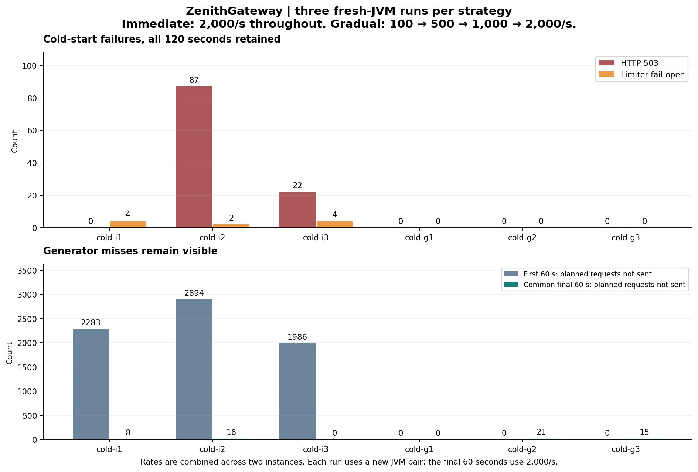
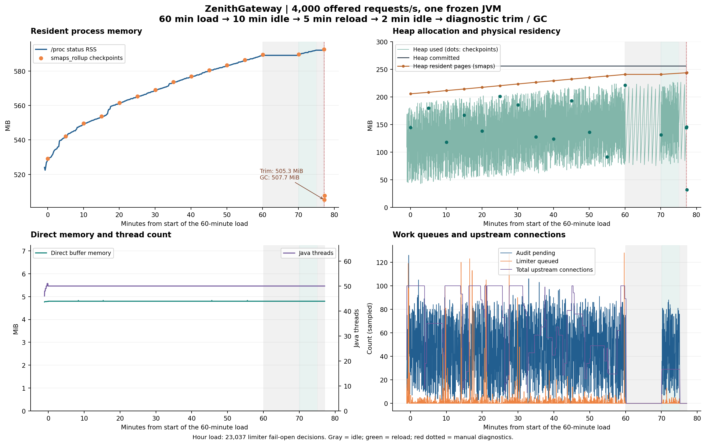
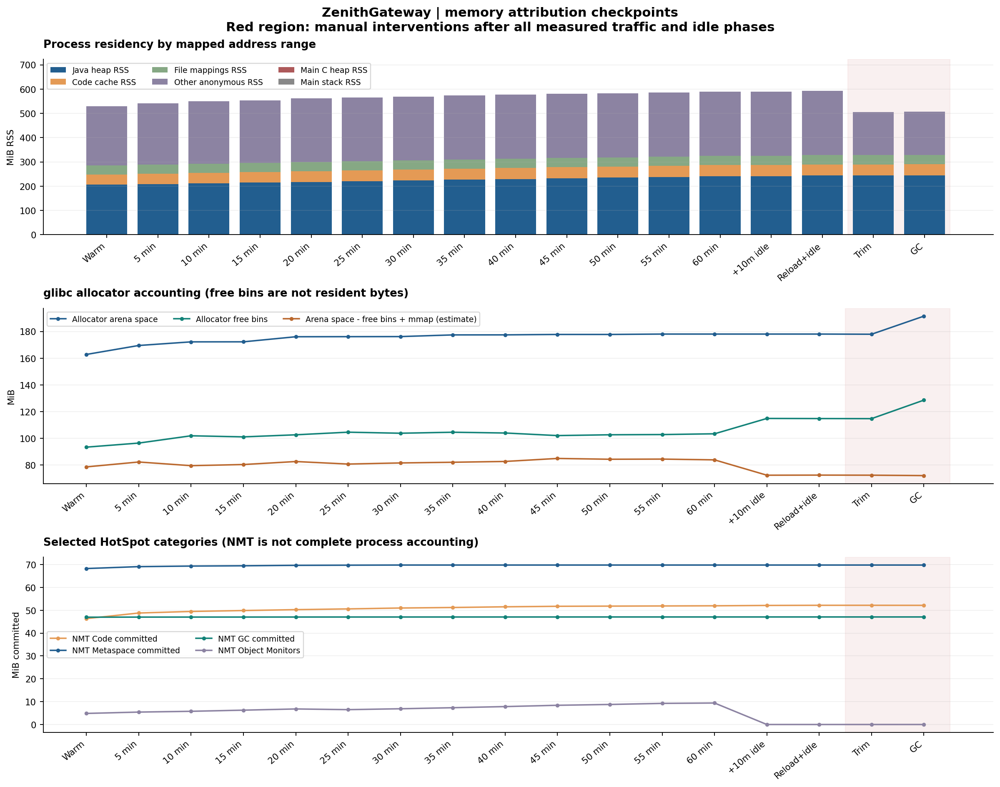

# ZenithGateway：长时内存与冷启动接流量诊断

日期：2026-10-04。冻结应用与既有资源限制，完成六组冷启动对照，以及 60 分钟持续负载、10 分钟空闲、5 分钟再次负载和 2 分钟空闲。人工 trim / GC 只在所有自然测量结束之后执行。空闲阶段停止代理负载，后台同步与管理指标采样继续。

本轮把三个问题分开：

1. **冷启动拒绝已复现并定位**：三轮立即接流量累计出现 109 次 503，均为新启动 B 实例的 `proxy_pool_full`；另有 10 次限流故障放行。三轮渐进接流量均未出现这两类退化。
2. **4,000 req/s 的长期健康容量尚未成立**：60 分钟完成 14,388,952 次 HTTP 200，但发生 23,037 次本地限流故障放行（0.1601%），必须判为不健康。空闲后的 5 分钟同速负载通过，不能替代整小时结果。
3. **RSS 增长中有明确的驻留与原生保留因素**：60 分钟检查点由 529.09 增至 589.43 MiB，最后 10 分钟仍增加约 6.12 MiB，未自然完全平台化。末尾 trim 使 RSS 从 592.59 降至 505.26 MiB，释放约 87.32 MiB；这是诊断证据，不是应用优化后的结果。

本轮没有部署或升级开发实例。变更范围为隔离实验脚本、离线分析工具和文档；应用 JAR、资源上限与原有产品代码保持冻结。

## 固定条件与判定口径

应用 JAR SHA-256：

```text
55e6be5e9888f97a33651732e6823a19caeabac91659e0eb75dbb5dbe615c2cf
```

- 同一台 i5-13500H 宿主机与 Docker Desktop Linux VM，16 个逻辑 CPU，约 16.63 GB VM 内存。
- A 使用逻辑 CPU 4–7，冷启动实验的 B 使用 13–15。CPU 集合在容器之间分开，宿主机和 VM 仍共享物理资源；A/B 资源不对称，不能据此证明扩容收益。
- JVM 使用 G1，堆初始 256 MiB、上限 512 MiB，直接内存上限 256 MiB，容器上限 1 GiB，NMT summary。两实例的 ActiveProcessorCount 均为 4，B 实际只有 3 个逻辑 CPU 的集合。
- 使用已有 capacity profile：8 个限流工作连接、128 个排队决策、500 ms 决策预算。默认 profile 的队列 64 保持原样。
- 每个上游目标最多 100 个代理连接与 100 个等待获取连接的请求，获取连接预算 500 ms。
- 32 条路由、同一个固定小响应 HTTP 上游；冷启动目标顺序是 A 的 32 条路由再 B 的 32 条路由，逐实例流量并非完全平滑；限流、监控、异步审计和熔断同时开启。共享桶每秒补充 10,000、容量 10,000。
- Redis 为独立单主、无持久化和副本；审计确认指 Redis 确认写入，不代表磁盘落盘或故障切换保障。
- 负载固定计划到达率，最多 256 个在途请求，绝对请求期限 8 秒。调度错过与在途上限错过单独计数，不记作成功。
- “健康”要求实际响应全部为 200、无传输失败、无故障放行、无审计丢弃或未知、无对账差异、无采样失败，且计划错过不超过 1%。HTTP 200 不能代替这一判定。

预先保存的 `plan.json`、镜像摘要、JVM 参数、实际就绪时间和测量脚本哈希均在证据中。所有失败阶段保留，没有筛掉冷启动错误或强制回收后的不利样本。

## 冷启动：拒绝来自哪里

六次均创建新的 JVM 对，顺序预定为立即、渐进、渐进、立即、立即、渐进。A 完成路由写入和一次真实转发，B 从存储恢复路由；实际负载在 B 就绪后约 1.01–1.07 秒开始。A 此时已就绪约 10.4–10.8 秒。

立即组前后各 60 秒都计划 2,000 req/s。渐进组先按 100、500、1,000 req/s 各运行 20 秒，再以 2,000 req/s 运行 60 秒。阶梯之间不重建负载端连接。两组全程负载组成不同，不能直接将全程 P99 当作同等负载的延迟比较。

| 运行 | 实际发送 | HTTP 503 | 限流故障放行 | 全程计划错过 | 共同末段实际发送 / 120,000 |
| --- | ---: | ---: | ---: | ---: | ---: |
| 立即 1 | 237,709 | 0 | 4 | 2,291 | 119,992 |
| 渐进 1 | 152,000 | 0 | 0 | 0 | 120,000 |
| 渐进 2 | 151,979 | 0 | 0 | 21 | 119,979 |
| 立即 2 | 237,090 | 87 | 2 | 2,910 | 119,984 |
| 立即 3 | 238,014 | 22 | 4 | 1,986 | 120,000 |
| 渐进 3 | 151,985 | 0 | 0 | 15 | 119,985 |



除表中 503 外，实际请求均为 200，无传输错误。三轮渐进组通过本轮健康判据，三轮立即组不通过。各组共同的最后 60 秒均为 200。

109 条 503 的响应正文、实例与时间全部留存，均来自 B，原因为 `proxy_pool_full`、阶段为 `admission`。立即 2 的错误完成于开始后约 4.37–5.16 秒；立即 3 为 0.59–0.73 秒。不是从状态码推断原因：正文与服务端原因计数一致。

采样捕捉到 B 的 100 个活动连接；等待连接数是离散采样，不能要求采样峰值恰好等于拒绝瞬间的等待上限。连接池等待上限以实际异常原因与固定配置共同核实。所有已完成请求均纳入监控与审计计数对账。审计 ID 去重检查限于 Redis 保留的最新 5,000 条/实例，不声称已逐条检查全部历史请求。

结论是：本次冷启动的连接池保护确实会在立即接流量时触发，逐级接流量的三次样本避免了这些拒绝。这不是“增大连接池即可解决”的证据，也不足以把唯一根因指定为 JIT、DNS、GC 或上游性能。A/B 的启动经历和 CPU 数不同，仅在固定对照内比较流量策略。

Reactor Netty 的 `warmup()` 初始化事件循环、解析器及本地库等资源；目标地址解析和实际建连仍可能发生在首个请求。因此仅调用 warmup 或固定多等几秒，不能直接视为已经验证的接流量方案。[Reactor Netty 官方 HTTP 客户端说明](https://projectreactor.io/docs/netty/release/reference/http-client.html)。

## 长时负载：完成实验与通过健康检查是两件事

| 阶段 | 计划请求 | 实际完成 / HTTP 200 | 限流故障放行 | 计划错过 | HTTP 200 P95 / P99 |
| --- | ---: | ---: | ---: | ---: | ---: |
| 60 秒预热 | 240,000 | 231,185 | 1,280 | 8,815 | 62.303 / 104.447 ms |
| 60 分钟测量 | 14,400,000 | 14,388,952 | 23,037 | 11,048 | 4.547 / 18.975 ms |
| 空闲后 5 分钟重新加压 | 1,200,000 | 1,199,821 | 0 | 179 | 2.199 / 3.381 ms |

60 分钟实际持续 **3,600.003 秒**，HTTP 200 吞吐约 **3,996.928 req/s**。所有实际请求返回 200，无传输错误；限流中 14,365,915 次确认为 allowed，**23,037 次为 local_fail_open，约占实际请求的 0.1601%**，redis_fail_open 为 0。这一阶段不通过健康判据。

11,048 个计划错过中，7,554 个属于调度错过、3,494 个属于在途容量错过，合计占计划量 0.0767%。它们没有被计为已发送或 HTTP 成功。HTTP 200 的最大耗时为 223.359 ms，包含调度等待后的 P99 为 20.863 ms；P99 不能说明故障放行是否发生。

监控完成、审计接收和审计确认均为 **14,388,952**。审计丢弃、结果未知、重试、采样错误和对账差均为 0，排空后 pending=0。最新保留的 5,000 个审计 ID 无重复；未逐条保留或检查全部 1,438 万条历史记录。

这证明固定条件下完成了整小时负载及计数核对，同时暴露出本地限流退化。不能将 HTTP 全部 200 改写为“4,000 req/s 长期健康”。上一轮 15 分钟通过仍是有效的历史样本，本轮使长期容量的结论更保守。

诊断有观察开销，本轮不剔除诊断时段。首次新增故障放行出现在约第 106 秒的采样区间，早于第一个 300 秒定时原生诊断；不能把全部退化都归因于 jcmd，也不能据此认定采集完全没有影响。累计计数把退化定位到本地限流分支，瞬时饱和的具体触发因素仍需独立对照。

空闲 10 分钟后重新加压 5 分钟，实际完成 **1,199,821** 次请求，全部 200，限流故障放行、审计丢弃、结果未知、传输错误和对账差均为 0，阶段通过健康判据。179 个计划错过全部为调度错过。P95/P99 为 **2.199 / 3.381 ms**。

空闲时上游连接已回收到 0，这次重新建连没有出现 503；同一个热 JVM 内的短窗口恢复良好。它与新 JVM 的冷启动条件不同，也不足以替代更长的健康负载验证。

## 内存：分清使用、提交与驻留

单位均为 MiB。以下检查点来自顺序采集的诊断，不能当作原子快照。

| 检查点 | 进程 RSS | 堆已用 | 堆驻留页 | 分配器空闲桶 |
| --- | ---: | ---: | ---: | ---: |
| 预热后 | 529.09 | 144.95 | 205.78 | 93.37 |
| 30 分钟 | 568.99 | 185.52 | 223.57 | 103.79 |
| 60 分钟后 | 589.43 | 221.59 | 240.92 | 103.36 |
| 再空闲 10 分钟 | 589.63 | 131.62 | 240.94 | 114.86 |
| 重新加压＋再空闲后 | 592.59 | 144.34 | 243.84 | 114.78 |
| 人工 trim 后 | 505.26 | 145.71 | 243.84 | 114.72 |
| 人工 GC 后 | 507.75 | 31.98 | 244.16 | 128.58 |

连续 10 分钟窗口如下；RSS 为进程状态采样，与上面的 smaps 检查点存在采样时刻和计数口径差异。

| 窗口 | RSS 首 → 尾，MiB | 堆已用中位数，MiB | 堆已用采样最低值，MiB |
| --- | ---: | ---: | ---: |
| 0–10 分钟 | 529.46 → 549.21 | 119.05 | 42.89 |
| 10–20 分钟 | 549.34 → 561.21 | 126.49 | 48.47 |
| 20–30 分钟 | 561.21 → 568.46 | 126.73 | 55.19 |
| 30–40 分钟 | 568.59 → 576.46 | 137.78 | 62.05 |
| 40–50 分钟 | 576.59 → 582.84 | 144.40 | 67.78 |
| 50–60 分钟 | 582.96 → 588.96 | 145.38 | 73.42 |

自然测量结束前，60 分钟 RSS 增量约 **60.34 MiB**，按地址映射拆分为：Java 堆驻留页 **+35.14 MiB**、代码缓存驻留 **+4.35 MiB**、其他匿名驻留 **+20.85 MiB**，文件映射等部分基本不变。这描述增量落在什么地址范围，不把“其他匿名内存”全部认作应用泄漏。

堆提交大小始终为 **256 MiB**，直接内存采样约 **4.79–4.83 MiB**，60 分钟内 Java 活跃线程始终为 **50**。堆已用并非完全平稳：首个与最后一个 10 分钟窗口的中位数分别为 **119.05、145.38 MiB**，采样最低值也从 **42.89** 升至 **73.42 MiB**。末尾显式 GC 后堆已用降至 **31.98 MiB**，说明累积量中有可回收对象；因为没有在初始状态执行同样的 Full GC 对照，不能据此证明所有存活集合都没有增长。

空闲 10 分钟后，RSS 为 **589.63 MiB**，与停流量前几乎一致；上游连接数和审计 pending 已为 0。与此同时，NMT 中 Object Monitors 从约 **9.40 MiB** 降至接近 0，分配器空闲桶从 **103.36** 增至 **114.86 MiB**。一部分原生分配已释放给分配器，驻留页仍被保留。

重新加压 5 分钟并再次空闲 2 分钟后，RSS 为 **592.59 MiB**，较前一次空闲结束约增加 **2.95 MiB**。分配器 arena 总量仍约 **178.06 MiB**，未再次出现启动阶段的同等增长。这支持已有空间得到复用，但只覆盖一次重新加压。

所有自然阶段结束后，`System.trim_native_heap` 使 RSS **592.59 → 505.26 MiB**，约回收 **87.32 MiB**；减少量落在其他匿名映射，Java 堆驻留页保持约 **243.84 MiB**。随后 `GC.run` 使堆已用降至 31.98 MiB，而 RSS 为 **507.75 MiB**，没有进一步下降。trim 释放量包含测量前就存在的可回收页，不能把它直接当成本小时增量的逐字节抵扣。

因此，本次证据支持“堆驻留增加、可回收对象累积及原生分配器保留共同影响 RSS”的解释。自然负载末段仍在增长，仍需把长时间趋势和不同负载形态保留为边界，不能简化成“已完全稳定”或“已确认泄漏”。






这些指标互不等价：

- heap used 是 JVM 当前使用的堆；heap committed 是 JVM 已提交的堆范围。
- smaps RSS 是地址映射实际驻留于内存的页。已提交大小不变时，驻留页仍可能增加。[Linux proc 文档](https://docs.kernel.org/filesystems/proc.html)。
- NMT 主要跟踪 HotSpot 内部内存，不覆盖进程内所有原生分配，不能用 NMT 合计代替整个进程 RSS。[JDK 21 NMT 文档](https://docs.oracle.com/en/java/javase/21/vm/native-memory-tracking.html)。
- glibc 空闲桶反映分配器账目，不等于相同数量的驻留页一定可立即归还；“arena 大小 − 空闲桶 + mmap”只是估算，包含分配器细节，不能当作精确的存活对象大小。
- 每份诊断文件顺序采集，存在时间差。每 5 分钟的诊断有观察开销，时间和请求结果均保留。

`System.trim_native_heap` 和 `GC.run` 只作为末尾诊断对照。前者尝试归还 Linux 原生堆的可回收部分，后者请求 GC；两者都未加入应用运行策略。[JDK 21 jcmd 文档](https://docs.oracle.com/en/java/javase/21/docs/specs/man/jcmd.html)。

## 工程决定与边界

应用代码与既有资源限制保持原样。本轮没有发现足以支持更改内存回收策略的产品缺陷；已有证据表明部分内存能回收并被复用，但不能据有限实验宣布“无内存泄漏”。维持正常 GC 策略，人工 trim 和显式 GC 仅用于此次诊断。

容量方面，保留已有 capacity profile 作为可复现实验条件，收窄对 4,000 req/s 的表述：它在这次一小时、带诊断采样的运行中未满足零故障放行要求。后续最有价值的工作是保持 8/128/500 ms 不变，补齐本地限流的按原因累计计数与等待时间，再用包含与不包含诊断的受控对照定位短时饱和。瞬时最后一条决策和被裁剪的审计列表不足以逐条归因整小时退化。

这轮没有凭总体 CPU、GC 汇总或热点印象修改线程数、连接池或队列。测量证明了保护行为和边界，具体饱和来源仍是下一轮需要验证的问题。

接流量建议从“就绪后立即全量”改为有观测的逐级引流：确认本实例已采用目标配置与路由，先给小流量，再根据连接池拒绝、限流故障放行、队列和审计待写入的增量决定是否继续提升。出现新增退化应暂停提升。本文的 100 → 500 → 1,000 → 2,000 是两实例实验的总流量，仅是验证过的样本，不是任何部署的通用阈值；自动流量权重控制没有在本轮产品中实现。

已有诊断入口均受管理认证保护，包括 `/settings/rate-limit/diagnostics`、`/settings/proxy/diagnostics`、`/monitor/audit/status`、`/settings/routes/diagnostics`、`/settings/runtime/sync`。计数比较应限定在相同实例生命周期内。

本轮只覆盖固定小响应的 HTTP、所述路由数和本机环境，不覆盖 TLS、大响应、长流、生产主从切换或数天运行。有限时长的内存收敛也不能排除所有泄漏。

## 复现、验证与保留

本轮新增发压器的 6 项测试在准备阶段通过；原生诊断兼容性试跑、六组冷启动对照和完整长时实验均完成。离线完整性核对的 **61 项检查通过**，覆盖冻结身份、参数、阶段时长、请求/审计计数、共同目标阶段、人工干预时机及清理记录。这些检查不等同于负载健康：三轮立即接流量、长时预热和 60 分钟阶段均明确保留为不健康。

应用使用冻结包，未重复运行后端/前端全量测试或重新构建。已有 **397 个文件的哈希全部保持一致**；原先记录的 **6 个容器名称均仍存在**，所有本轮记录 ID 对应的容器、网络和临时认证文件已清理。开始时只记录了既有容器名称，因此不声称做过既有容器 ID/状态的完整前后比较。

交付：

- [机器可读验证索引](backend-stability-validation-2026-10-04.json)
- [逐阶段与内存汇总](backend-stability-summary-2026-10-04.json)
- [复现说明](../benchmarks/STABILITY.md)
- [冷启动连接池时间线](images/stability-20261004/cold-start-pool.png)
- [内存时间线 SVG](images/stability-20261004/memory-timeline.svg)
- [内存分解 SVG](images/stability-20261004/memory-attribution.svg)

原始目录为 .dev/stability-20261004-7939c7ff/，包含冻结 JAR、预先保存的计划、每秒发压数据、每阶段原始记录、17 份原生检查点、日志、实际测量源脚本归档及清理记录。该目录被 Git 忽略，交接原始证据时需要另行携带；docs 中保留独立可读的汇总和图表。

复现入口见 `benchmarks/STABILITY.md`，运行工具为 `benchmarks/stability.mjs`，离线汇总、图表与完整性核对分别为 `summarize-stability.py`、`plot-stability.py`、`validate-stability.py`。

验证结果区分实验完整性、每阶段健康性与文件保留检查。旧验收证据和先前 15 分钟样本保留，本轮没有把过去的通过改写为失败，也没有把本轮的故障放行隐藏在 HTTP 成功率中。
