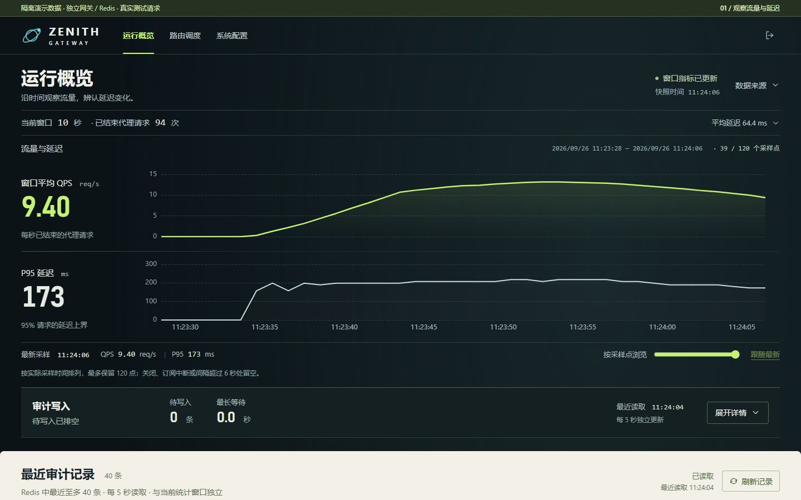
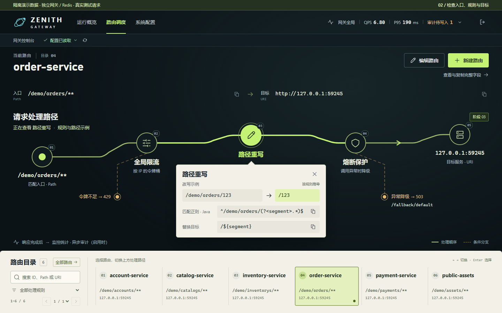
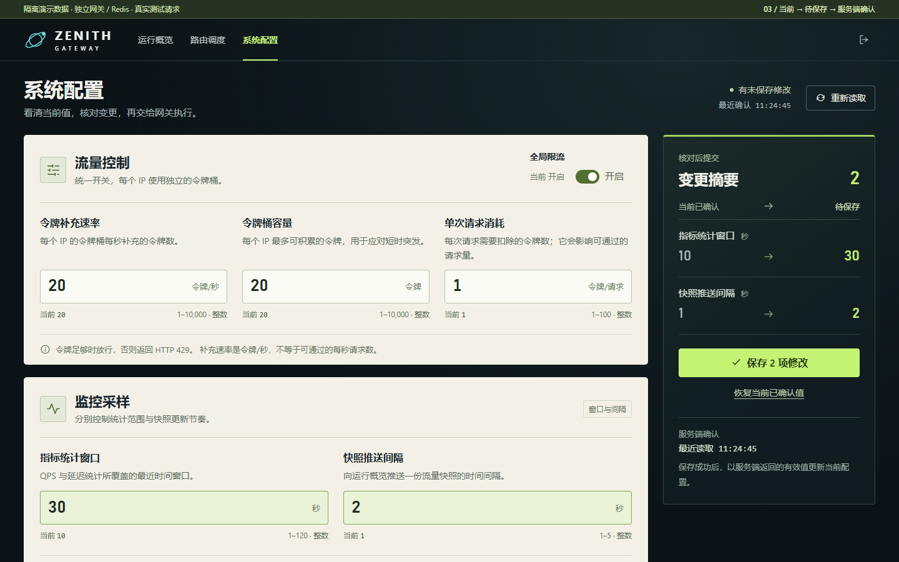

# ZenithGateway：从观察到变更确认

ZenithGateway 是面向 Java 后端与平台工程师的 API 网关项目：用一套控制台观察全局流量、理解路由配置、调整运行参数，并核对服务端实际确认的结果。后端基于 Java 21 / Spring Cloud Gateway，前端使用 Vue 3、TypeScript 和 ECharts。

这份展示的重点是把系统能力解释清楚。概览以实际时间、QPS 和 P95 趋势组织画面；路由页将入口、限流、重写、熔断与目标按真实执行关系展开；配置页区分当前值、草稿和服务端确认。深石墨画布用于判断，黄绿色用于操作焦点，浅色区域用于逐项阅读。

[早期控制台演示：80.04 秒](media/stage-c-product-demo.webm) · [阶段 C 证据与取舍](stage-c-final.md)

| 时间 | 演示动作 | 可验证的能力 |
| --- | --- | --- |
| 0–21 秒 | 认证、观察概览、浏览采样、展开审计摘要 | REST / SSE 数据更新，当前窗口与历史读数分开 |
| 21–46 秒 | 搜索并选择订单路由，展开重写与熔断节点 | 完整目录、规则示例、429 / 503 条件分支 |
| 46–64 秒 | 将统计窗口 10 → 30 秒、推送间隔 1 → 2 秒，核对并保存 | 六字段校验、差异摘要、一个 PUT、采用服务端返回值 |
| 64–80 秒 | 返回概览，确认 30 秒统计窗口 | 真实跨页面变化；运行配置、Redis 与快照相互核对 |

## 三页代表画面

## 面向后端岗位的三个工程案例

求职展示围绕可验证的状态边界展开：冲突发生时保护什么，基础设施故障时采取什么动作，以及响应中断后到底能确认什么。下面的案例来自后续后端实现与故障补验；上面的阶段 C 录屏保留为早期控制台展示，不代表它已演示这些新增协议。

### 1. 配置冲突、提交结果确认与安全回滚

**问题。** 两个管理员从同一版本打开表单，后保存的整份旧表单可能覆盖先前修改；响应丢失后，当前参数相同也不能证明原提交执行过。把历史值直接写回还可能让版本退回，或在预览后历史已被裁剪时恢复错误来源。

**方案。** 六字段与带世代的版本组成不可变快照。Redis 内一次原子决策核对 expectedVersion 与 operationId，请求内容绑定操作身份；配置、回执与必要记录由同一发布写入确认。本地以一个引用发布完整快照，后台同步只单调采用。回滚由服务端核实成功历史，作为一个新操作生成新版本；版本 18 恢复版本 12 的参数，应生成 19，而不是回到 12。

**失败实验。** 同版本并发写入只能有一个成功；同 ID 换内容必须拒绝；分别丢 Redis 回复与 HTTP 回复，通过回执查询原操作；原操作后已有新版本时，查询与重试不得覆盖后续状态；来源裁剪前后分别验证新回滚拒绝与原成功回执仍成立。前端冲突保留草稿，明确丢弃后迟到查询不能复活旧操作。

**边界与讲解重点。** AtomicReference 解决本实例完整读取，条件写入解决存储并发，二者不能相互替代。保存确认不代表全部实例同时采用。回执保证窗口 24 小时、活动回执最多 512 条；历史最多 100 条/7 天，记录过期不能推断原操作未执行。单 Redis 权威范围不等于故障切换后的永久 exactly-once。

证据与协议：[配置一致性](backend-config-consistency.md)、[提交回执](backend-config-operations.md)、[安全回滚](backend-config-rollback.md)。统一发布验收对应 `config-sync`、`config-operations`、`config-rollback`。

### 2. Redis 故障下的限流决策

**问题。** 跨实例的 IP 桶不能因网关时钟差或旧策略迟到而重复补额度。本地队列饱和、Redis 不可用和已扣费却丢回复，也不能统称为“明确额度不足”。

**方案。** 原子决策使用 Redis 时间，计费时间不倒退；已有余额随已确认策略切换，旧请求不能改回新桶策略。代理从本地配置快照取参数。限流客户端具备有界准入、执行与队列；本地资源失败和 Redis 额度未确认分别配置 allow/reject，默认仍放行。明确额度拒绝为 429，严格故障策略为保护性 503。事实、决策动作、扣费是否确认与最终 HTTP 结果分别记录。

**失败实验。** 双实例合计扣费与实际补充量对账；用受控时间夹具测试回拨；注入队列饱和、Redis 断连、命令执行后丢回复与取消。严格拒绝时上游接收量必须为 0；回复丢失保留 unknown，不自动重试或退还令牌；恢复后检查迟到命令、队列和连接释放。JSON false 必须作为非法桶/策略暴露，不能等同于键不存在而初始化满桶。

**边界与讲解重点。** 故障放行是可用性选择，不是分布式额度保证；保护性 503 在主动故障实验中可以符合预期，在健康容量实验中仍失败。unknown 是独立维度，不能与动作分类相加当总请求数。开关和策略跨实例异步传播，不宣称配置保存即全局配额瞬时一致。

证据与协议：[限流可靠性](backend-rate-limit-reliability.md)、[故障策略](backend-limiter-failure-policy.md)、[监控语义](backend-limiter-monitoring.md)。统一发布验收对应 `rate-limit`、`rate-limit-malformed`、`limiter-policy` 及监控规则测试。

### 3. 客户端取消与安全退出竞态

**问题。** readiness 恢复完成不等于新 JVM 已能立刻承受目标流量；退出时也需要区分已准入请求和后续请求。截止信号到达、真正赢得终态竞争、回退结束是不同事件，错误归因会把中断请求记成 completed。

**方案。** 接流量按明确窗口核对 HTTP、故障决策、队列、延迟与审计，再决定是否提升。退出先关闭业务准入，在途请求按预算排空，再处理审计并释放客户端。shutdownForced 只在超时真正选中回退后设置；最外层 CANCEL 始终记录 cancelled，即使截止归因仍为 shutdown_deadline。已提交的响应只中断，不追加错误 JSON。

**失败实验。** 第一轮屏障复现“截止未胜出就设置强制标志”，正常 200 和取消均曾错记；第二轮复现“截止已胜出、回退未结束时取消”，分别曾得到 0/completed、200/completed。修复后保持 0/cancelled、200/cancelled，同时不误改未取消的 503/http_error 与部分响应 200/error。真实 keep-alive 新请求拒绝、慢请求、流式中断、SIGTERM 及 Redis 离线审计排空分别对账。

**边界与讲解重点。** 生命周期 completed 是终止 lease 数，不能当作成功响应数。精确竞态由受控信号夹具证明，真实链路另外验证，二者不互相冒充。当前权重变化来自验收发生器，真实外部负载均衡器摘除传播仍待验证；取消不能撤销上游已经产生的业务副作用。

证据与协议：[接流量和安全退出](backend-traffic-lifecycle.md)、[原仲裁 P2](backend-traffic-lifecycle-p2-fix.md)、[回退期间取消 P2](backend-traffic-lifecycle-fallback-cancel-fix.md)。统一发布验收对应完整后端竞态测试、`lifecycle-functional` 和 `lifecycle-signal`。

## 别人如何复验

使用[统一发布验收说明](release-acceptance.md)，选择提交层或发布层。入口导出构建输入、安装锁定依赖、构建一次并冻结产物，报告同时给出 Git 提交、工作区状态、输入清单哈希、JAR 哈希、实际执行项、失败日志和资源清理。未提交工作区只能显式作为脏快照验证，不能冒充某个干净提交。

当前**没有通过一小时验证的健康容量档位**；4000 req/s 的一小时验证未通过。下面的录屏请求量与发布功能检查只证明对应功能及故障行为，不作为稳定容量承诺。结果交接仍默认关闭，真实滚动替换和内存归因继续作为独立专项。

录屏使用独立网关、Redis 和测试上游，显示环境标记。986 次 HTTP 200 与 23 次 HTTP 500 均来自实际测试代理请求；这些小规模请求用于演示，不是吞吐压测。写入与真实指标来自后端，顶部环境和步骤文字只是录制说明层。测试结束后恢复配置并清理独立资源。

本项目没有用无来源的健康评分、逐路由指标或任意历史区间填补界面。P95 超范围只表示 > 60,000 ms；未保存草稿只保留在当前页面内存中。这些边界与实现能力一起展示。
