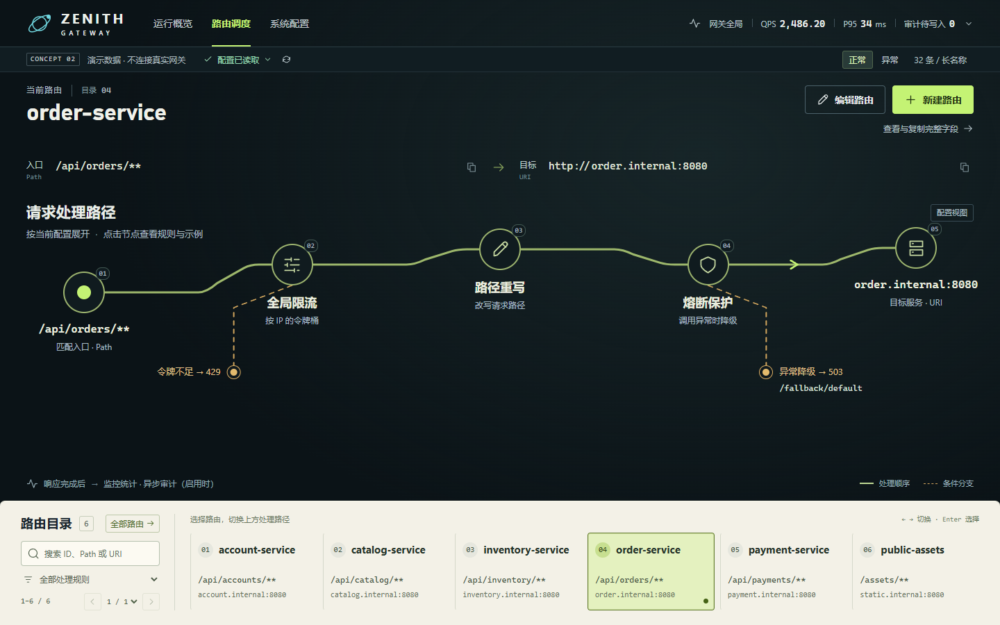
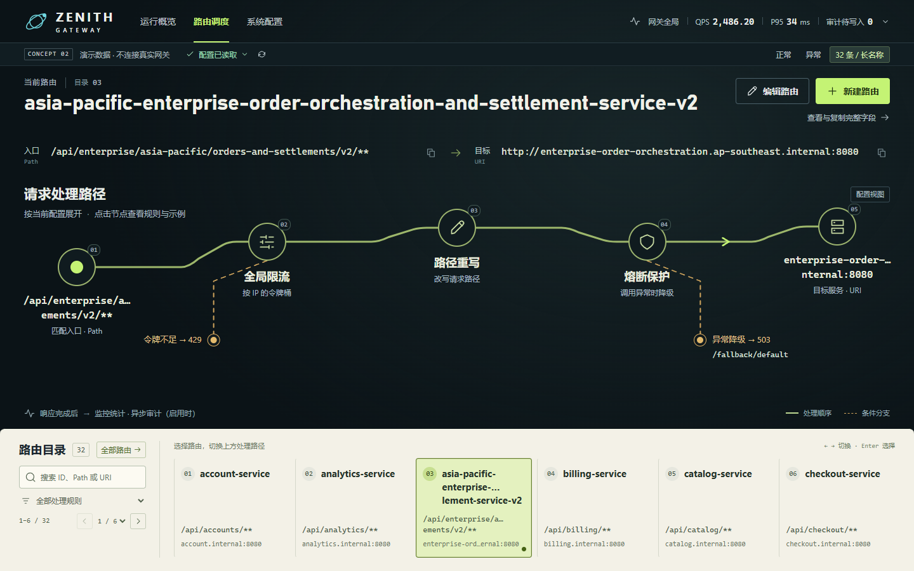
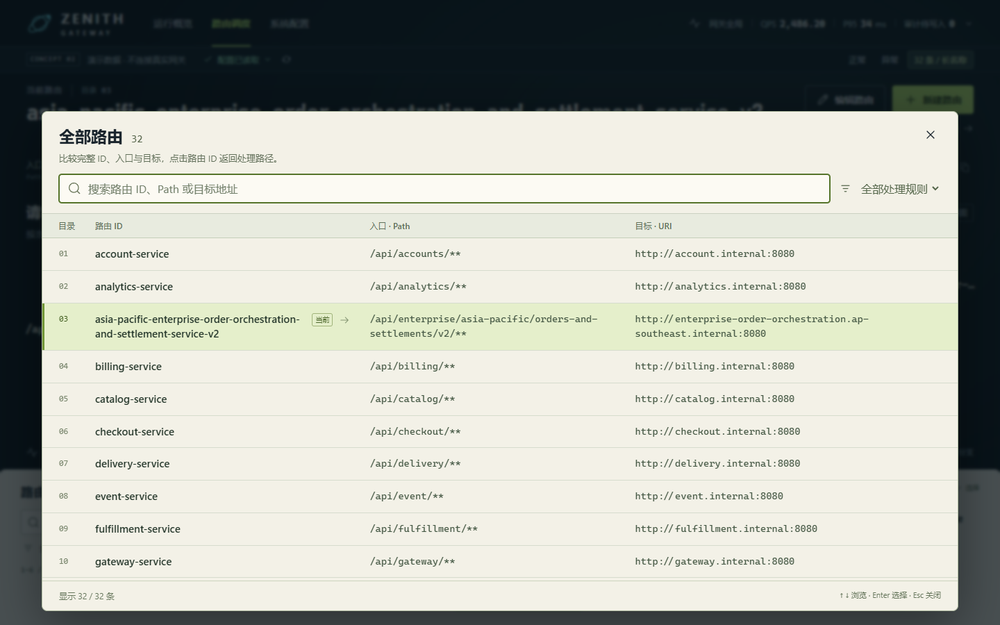
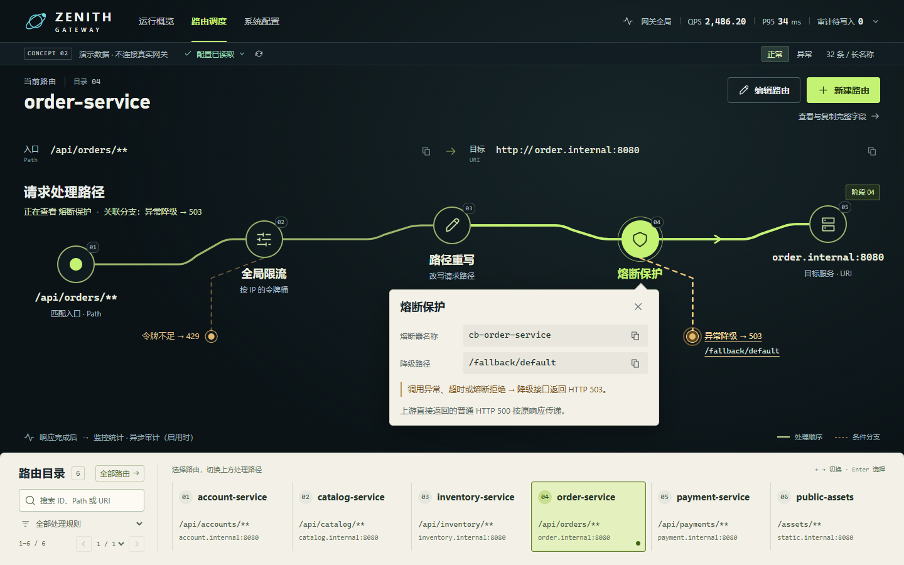

# 路由管理页设计打磨

2026-09-25。本轮直接修改正式路由页与预览共用的组件，延续深色路径画布和浅色底部调度条。

## 查看

- 正式页面：[路由管理](http://127.0.0.1:5173/routes)，沿用管理认证与实际接口。
- 场景预览：[正常](http://127.0.0.1:15174/routes/preview?scenario=normal)、[32 条及长名称](http://127.0.0.1:15174/routes/preview?scenario=dense)、[配置读取异常](http://127.0.0.1:15174/routes/preview?scenario=exception)。
- 下面的截图和录屏来自 Edge 实际渲染，使用页面内明确标注的演示数据；演示页面不请求后端。
- 正式页的认证、Redis 持久化、转发及异常恢复另用独立真实后端回归，未修改现有开发服务中的路由。

## 三个主要改变

1. **以名称、入口和目标识别路由。** 大目录序号退为辅助标签，名称保持一致字号；完整 Path 和 URI 并列，均可直接复制。标题及端点预留换行空间，现有长短名样本在 1440、960、768、390、320px 下切换完成后的标题、端点和路径起点变化均小于 1px（减少动效模式测量）。内容超出预留空间时继续完整换行。
2. **亮度集中到当前操作。** 普通节点使用低亮度轮廓，悬停改变底色和边线，选中使用实心黄绿色与清晰外圈；移除常驻光晕。节点展开时，其相邻处理连线与关联的条件分支分别突出，标题显示正在查看的阶段。限流面板与 429 分支、熔断面板与 503 分支错开，关闭后恢复整体路径并归还节点焦点。
3. **为比较和查找提供“全部路由”。** 桌面展开为完整 ID / Path / URI 表格，1440×900 下可同时看到 10 条完整记录；底部仍保留分页调度条。两个视图共用搜索、处理规则筛选和选中路由。搜索与翻页保留当前画布，点击 ID 或 Enter 确认后关闭面板、定位底部所在页并回到路径。支持方向键、Home / End、Esc，Esc 保留搜索。手机上按每条路由纵向排布字段。

完整的 9 个配置字段及 JSON 复制、创建、修改、确认删除保持可用。读取失败时保留缓存视图并阻止写入，“全部路由”也标注缓存配置；重试恢复后重新允许管理操作。

## 截图与录屏

正常，1440×900 首屏：

长名称与 32 条分页目录，1440×900 首屏：

全部路由，比较完整字段，1440×900：

熔断节点展开，其 503 分支保持可见，1440×900：

补充：[960px 长名称](images/routes-polish-dense-960.png)、[390px 全部路由](images/routes-polish-directory-390.png)、[390px 就地展开](images/routes-polish-node-390.png)。

[实际浏览器短录屏（WebM，1440×900）](media/routes-polish-interaction.webm)：打开全部路由 → 搜索 order-service → 选择结果 → 打开熔断节点及其关联分支 → 关闭节点 → 搜索 payment 并切换 payment-service。录屏使用正常动效，无循环流光或实时请求模拟。

## 验证证据

汇总及原始检查数据见 [验证记录](route-polish-validation.json)。

| 检查 | 结果 |
| --- | --- |
| 前端单元测试 | 15 项通过 |
| 现有页面浏览器回归 | 14 组通过 |
| 新目录、焦点、复制与布局检查 | 10 组通过 |
| 独立真实后端浏览器联调 | 12 组通过 |
| TypeScript 与 Vite 生产构建 | 通过 |
| 预览 JS 错误 / 后端 API 请求 | 0 / 0 |

新检查覆盖：双向共享搜索和筛选、关闭后焦点、确认选择及分页定位、32 条完整字段、长短名切换、节点三种视觉状态、关联分支无遮挡、复制精度、缓存恢复、320–1440px 布局。正常、长名称密集目录、正常路由节点展开的 1440×900 截图均为首屏。

联调沿用现有脚本，覆盖首次加载、空目录、首次失败、认证退出与 401、真实增删改、重写转发、普通上游 HTTP 500 透传及异常降级 503、限流参数轮询、缓存、写入成功后读取失败、指标不可用与重试。部分失败通过拦截 GET 响应注入，写入和转发使用独立后端与 Redis。测试资源已清理。

重放本轮新增检查和录屏：

~~~powershell
. ./.dev/upgrade-tools/env.ps1
node .dev/browser/node_modules/playwright/cli.js install ffmpeg
node verification/route-polish.mjs
~~~

要求正在运行的前端及 Playwright。默认地址为 15174，Windows 使用 Edge；可设置 ROUTE_CONSOLE_URL、BROWSER_CHANNEL，设置 ROUTE_POLISH_RECORD=0 跳过录屏。该脚本只操作预览内存数据。

## 仍有的取舍

- 预留换行空间使短名称下方更空，但切换到长名称时不再推动路径起点；超长内容不强制截断，可能增加页面高度。
- “全部路由”更适合比较完整字段，展开时暂时遮住路径；选择后即返回路径，日常快速切换继续使用底部调度条。
- 窄屏通过纵向字段和独立目录滚动保持完整性，单屏能比较的路由更少。长目录卡片与节点展开同时出现时也可能需要纵向滚动；复杂规则在节点面板内滚动，完整字段弹窗仍可查看和复制。
- 本轮验证了 32 条路由的交互与布局，没有进行人群可用性计时测试，也未据此声称查找效率提升比例。
- 原有主 JS 块超过 500 kB 的构建提示仍存在，本轮未改动依赖或打包分块。

路径始终表达真实配置的处理顺序与条件分支。选中高亮不表示请求正在流过，配置读取成功不表示上游健康。
