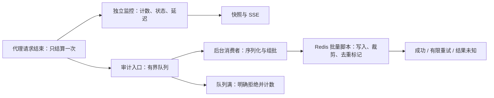

# 第二轮路线：审计可靠性与监控准确性

状态：实现、回归与本地验收已完成。结果见 [第二轮验收报告](../benchmarks/second-round-2026-09-23.md)，运行说明见 [审计与监控](audit-and-monitoring.md)。依据：2026-09-23 第一轮代码与 [基线报告](../benchmarks/baseline-2026-09-23.md)。

**目标：在定义的正常负载下消除审计并发丢失；Redis 变慢时监控仍准确、网关开销有界；故障中的每条审计事件都有明确状态。**

**交付顺序：2.1 监控解耦 → 2.2 并发队列 → 2.3 批量持久化与故障恢复 → 2.4 验收与报告。** 每一步单独形成可验证的提交，生产行为切换以整体验收为门槛。

## 1. 问题与语义

| 当前证据 | 对应问题 |
| --- | --- |
| 限流 + 审计：120,647 条事件，13,067 次发射失败，约 10.83% | 多个请求线程直接调用同一 sink.tryEmitNext |
| Redis 增加响应延迟：7,920 条事件，1,752 次发射失败，约 22.12% | 并发发射问题在慢 Redis 下继续出现 |
| 以上发射失败日志均为 FAIL_NON_SERIALIZED | 增大缓冲容量无法消除该类竞争 |
| TrafficMetricsService 从审计事件流统计请求 | 审计丢弃会让 QPS、状态分布和延迟指标失真 |
| 审计开关在 AuditLogFilter 最前面返回 | 关闭落盘也停止监控统计 |
| 每条事件执行 LPUSH 后再 LTRIM | Redis 往返开销随事件数线性增长 |
| doFinally 中空状态直接记为 200 | 异常及取消路径可能被统计成成功，需请求级测试确认并修正 |
| 每秒最多 256 个延迟样本直接合并 | 不同秒流量差异较大时，窗口 P95 的样本权重不等于请求权重 |

Reactor 明确说明 tryEmit* 并发调用可能快速失败，线程安全不等于自动排队等待发射成功。[Reactor Sinks 文档](https://projectreactor.io/docs/core/release/reference/coreFeatures/sinks.html)

本轮沿用当前“运行监控与近期请求日志”的定位，优先保证代理可用性。使用有界内存队列，正常负载下要求零丢失；队列满、服务长期不可用或停机排空超时可以显式丢弃并计量。该方案不提供进程崩溃后零丢失、长期审计归档或端到端 exactly-once 保证。若业务要求这些保证，需要另立本地持久化日志/可靠消息存储与恢复机制的设计。

“已写入”指 Redis 确认执行成功，不等于磁盘持久化；近期列表按保留数量裁剪也不属于发布失败。

## 2. 目标链路



请求线程只完成必要的信息采集、内存统计和队列尝试入队。JSON 序列化、Redis 调用、批次重试在后台执行。后台异常不能传播为业务请求失败。

## 3. 2.1：请求完成采集与监控独立

主要修改：AuditLogFilter、TrafficMetricsService、TrafficMetricsSnapshot、TrafficData 及相关测试。

- 提取统一的请求完成记录入口；代理请求包括 429、上游异常、超时、fallback 与取消，每次只结算一次，管理接口沿用当前不计入代理流量的范围。
- 结合响应提交状态和完成/错误/取消信号记录结果；未形成 HTTP 响应时用独立 outcome 表达，不伪造 200 或可见的客户端 HTTP 状态。
- 监控直接接收请求完成记录，取消对 AuditEventPublisher 的依赖。审计关闭、队列满或 Redis 故障不影响监控计数。
- 保留 zenith.audit.enabled 作为审计持久化开关，增加独立的监控开关。记录这一语义变化，更新前端对取消/未知结果的显示。
- 监控入口改成多线程调用后必须重新验证并发安全，不能直接搬用现有单流消费下的假设。
- 延迟统计采用可并发记录、可合并的固定桶直方图，以请求数合并窗口。桶边界固定并测试，目标量化误差不超过 max(1 ms, 实际值的 5%)；超范围值显式标记。
- 测试使用可控时钟，覆盖窗口切换、不同秒流量悬殊、并发记录与读快照。快照读取避免重复排序全部样本。

验收：在可控有限请求集、所有完成回调结束后，累计监控计数与请求结果逐条对应；禁用审计和注入审计故障时结果相同。QPS 的“窗口平均”语义在接口和前端描述一致。

## 4. 2.2：并发安全、有界的审计入口

主要修改：AuditEventPublisher；新增 AuditQueue、AuditWorker 或等价职责清晰的组件。

- 入口只生成稳定的事件 ID 和不可变事件信息，多个请求线程写入有界队列，由单个后台消费者读取。
- 禁止在请求线程等待队列空位或通过忙等反复 emit。具体队列实现须支持多生产者并验证容量边界；不要使用无界队列替代并发失败。
- 容量约束覆盖排队、正在组批、在途批次及重试持有的数据，不能只限制第一层队列。另设事件大小、批次字节数和客户端离线命令队列上限。
- 满队列采用拒绝新事件的确定性策略，记录 queue_full；过大事件和序列化失败有独立原因。禁止通过路径/IP/事件 ID 构造监控标签。
- 每条失败逐条 warn 改为限频汇总日志，精确数量由指标提供。
- 审计 worker 生命周期受 Spring 管理，避免遗留订阅、定时器与孤立重连任务。

初始保留当前 20,000 条的配置值用于对比；实际默认容量需根据事件大小上界和 JVM 内存预算校验后确定。

验收：并发突发测试中，只要队列容量足够，所有唯一事件都被消费者接收且无重复；强制缩小容量后，接收数和显式拒绝数可以对账。后台消费停滞时内存保持有界，请求线程不等待 Redis。

## 5. 2.3：Redis 批量写入、去重与故障处理

主要修改：新增 AuditBatchWriter、Redis Lua 脚本、审计客户端配置及真实 Redis 集成测试；调整 AuditQueryController 兼容新记录字段。

建议初始参数（待压测调整）：

| 参数 | 初始值 | 含义 |
| --- | --- | --- |
| batch-size | 100 | 每批最多事件数 |
| flush-interval | 20 ms | 低流量下的组批等待上限，不包含网络和排队时间 |
| batch-max-bytes | 256 KiB | 控制单次脚本负载 |
| max-in-flight-batches | 1 | 首版顺序写入，简化状态与顺序保证 |
| retry-max-elapsed | 10 s | 含退避的批次总重试预算，仍受命令超时约束 |
| dedup-ttl | 120 s | 覆盖重试与客户端重发期限，需启动校验 |
| shutdown-drain-timeout | 5 s | 正常停止时的最大排空等待 |

- 一批通过一次 Lua 调用完成多个值的 LPUSH、一次 LTRIM 和去重标记；保持单实例入队顺序对应的“最新在前”查询语义。暂不承诺跨实例按时间全局排序。
- Lua 在 Redis 中原子执行，同时会占用 Redis 执行线程，因此必须限制批次体积并测量其对限流尾延迟的影响。[Redis Lua 文档](https://redis.io/docs/latest/develop/programmability/eval-intro/)
- 每批生成 batchId。网络错误后的重试保持批次 ID 和内容不变，在限定期限内通过去重标记确认或跳过已执行批次。
- LPUSH 本身不幂等，直接重试会重复追加记录。[Redis 幂等性说明](https://redis.io/blog/what-is-idempotency-in-redis/)
- 去重仅作为正常 Redis 实例与有效去重窗口内的重试保障；Redis 状态丢失、故障转移或脚本执行异常可能使结果无法确认，不宣称 exactly-once。脚本原子执行也不等于发生运行错误时自动回滚。
- 明确分类：确认写入、确认未写且丢弃、写入结果未知、仍在队列/在途。超时后已经可能写入的批次不能直接计为确定丢失。
- 用批次级错误处理替换宽泛的 onErrorContinue。单批失败不会永久终止后续消费；长期故障采用有界退避，恢复后自动继续。
- 为审计使用独立客户端连接及有界客户端队列，减少其对限流连接的干扰。连接隔离不能隔离同一 Redis 实例的 CPU/执行时间。
- 正常停机先停止接收新代理请求，待请求完成后停止审计入队，再限时排空；超过期限汇总剩余状态。强制终止时内存中事件可能丢失。

兼容策略：继续使用 Redis List 和现有 recent API。新增事件 ID/outcome 等字段时，服务端与前端能读取旧记录。脚本基于当前 Redis 7.4 能力实现。多键去重脚本若未来迁移 Cluster，需要另外设计同槽 key 和迁移方案。

## 6. 可观测性与对账

保留现有 received、persisted 指标语义并明确 persisted 为 Redis 确认数量；扩展有限枚举的 dropped 原因，以及 uncertain、queue.depth、queue.bytes、oldest.age、inflight、batch.size、batch.duration、retry、last.success.age。

在同一进程、审计开启、受控输入停止后，以稳定快照检查：

```text
审计入口接收总数
  = 已确认写入
  + 已确认丢弃
  + 写入结果未知
  + 排队与在途事件
```

重试不重复增加 received；去重命中只结算一次。并发运行中的多指标抓取不是事务快照，不要求每一帧精确相等。进程被强制终止时不能仅凭内存计数证明数据完整。

仪表盘增加队列水位、最老事件等待时间、丢弃率、结果未知数和最近写入状态，区分“业务流量下降”与“审计处理积压”。

## 7. 2.4：测试、压测与验收

| 场景 | 必须满足 |
| --- | --- |
| 正常 Redis、约定持续负载 | 审计发射竞争丢失为 0；排空后无未解释差额 |
| 多生产者并发、序列化失败、容量极小 | 无重复/无静默丢失；拒绝原因和计数准确 |
| 审计关闭、审计消费者停滞 | 代理流量监控仍完整，内存受限 |
| 429、上游 5xx、超时、fallback、取消 | 每个请求结算一次，结果语义正确 |
| 写入完成后丢失响应、重连与重试 | 在去重有效期内不重复写入同批次，确认失败归入 uncertain |
| Redis 慢、断开、恢复 | 后台消费可恢复，有限重试，积压与拒绝可见 |
| 正常停机和强制终止 | 前者验证排空期限与剩余分类；后者验证文档声明的内存丢失边界 |
| 非均匀流量、直方图桶边界、窗口变化 | P95 满足约定量化误差，计数按请求权重合并 |

压测同时保留第一轮闭环场景用于开发比较，并补充：

1. “仅转发”“仅限流”“限流 + 独立监控”“限流 + 监控 + 审计”的明确开关矩阵。第一轮关闭审计会一起关闭监控，需避免把开关语义变化误认为性能退化。
2. 固定到达率测量：先验证 3,000 req/s、持续 5 分钟的健康场景；再逐步提高负载找饱和点。记录发送器漏发和在途上限，防止闭环低吞吐掩盖积压。
3. 审计连接单独增加延迟/断连，与整个 Redis 服务退化分别测量。整个 Redis 退化时，现有限流的 500 ms 超时也会影响响应，不能全部归因于审计。
4. 每组至少 3 次，记录中位数、离散程度、P95/P99、CPU、内存、队列水位、成功写入率和脚本开销；流量停止后继续采集直到排空或预算耗尽。
5. 完整性测试使用足够的 Redis 保留容量或独立验收存储，不能拿默认只保留 5,000 条的列表长度去核对全部历史接收数。

硬门槛：已约定的健康负载下，queue_full、其他丢弃、uncertain 均为 0；结果与监控准确；故障时内存有界且恢复可用。

性能优化目标：在完整记录事件的前提下，常规审计场景吞吐接近“限流 + 独立监控”场景，追加审计后的吞吐差距先以 10% 内为目标。该百分比是待验证目标，不是承诺；与第一轮存在丢记录的约 4,021 req/s 比较时，应同时展示完整写入数。增加低流量审计可见延迟指标，验证批处理没有不可接受的等待。

## 8. 交付与后续范围

交付物：四步实现、回归/集成/故障测试、可重复压测脚本、第二轮基线报告、配置说明及兼容性说明。队列 worker、批量 writer 与监控职责分离，方便逐项审查和定位回归。

本轮聚焦单实例审计与监控。多实例配置广播、运行配置 CAS/版本冲突处理、跨进程可靠审计存储及前端包体积优化作为后续独立路线。关闭审计持久化可作为故障时的运行选项，监控在新架构下继续工作。
