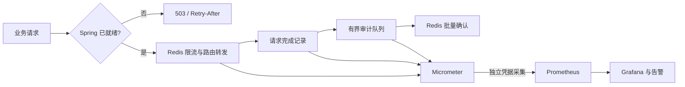
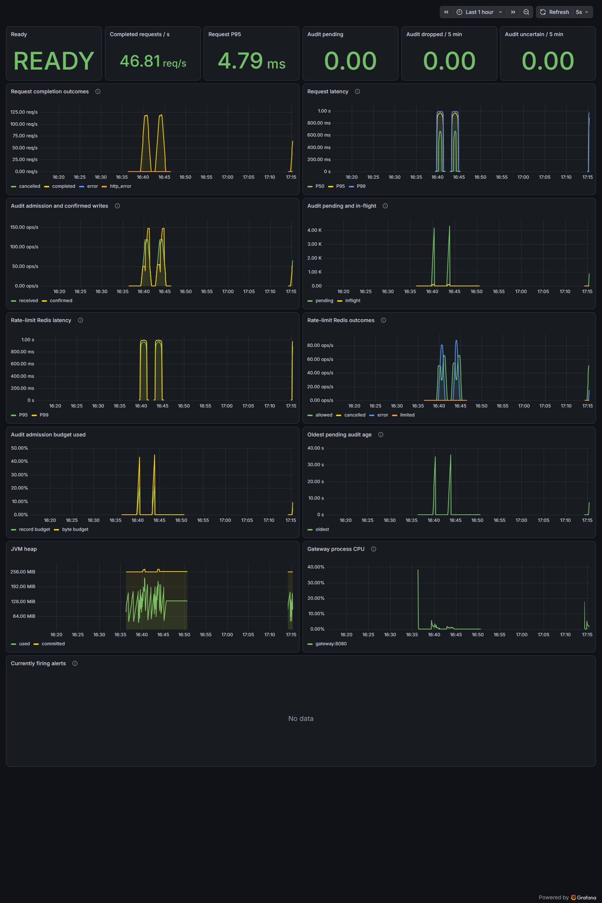

# 第三轮：可运行、可观察、可验证

本轮围绕 Java 后端／网关与中间件求职展示，补齐启动保护、运行指标、故障演示与可复现性能证据。依赖版本沿用上一轮升级结果。

## 已实现

- 就绪门禁：端口已监听但配置尚未恢复时，业务请求返回 503；失败启动不会静默采用默认配置。
- 独立采集凭据：Prometheus token 仅授权采集端点；匿名探针不暴露组件详情。
- 17 面板 Grafana 看板、7 条告警规则，覆盖请求、限流 Redis、审计、JVM。
- 真实 Redis 故障演示：暂停、继续请求、恢复、排空、对账、验证告警解除，自动恢复测试配置。
- Linux 容器验证、Windows PowerShell 5.1 / 7 启动验收、固定 CPU 分配的性能与 JFR 工具。
- 用 JFR 识别小容器默认 Serial GC 的暂停开销，容器启动显式固定 G1；同样约 61 秒录制的累计暂停由 7.05 秒降至 1.03 秒。

## 验证记录

2026-09-23 实测：

| 检查 | 结果 |
| --- | --- |
| Windows 后端 verify | 98 项，0 失败、0 错误、0 跳过 |
| Linux 后端 verify + 真实 Redis | 98 项，0 失败、0 错误、0 跳过 |
| Linux npm ci / 前端测试 / 构建 | 10 项通过；生产构建成功 |
| Linux 工具链 | Microsoft JDK 21.0.12.1+1、Node 24.21.0、Maven 3.9.16 |
| 根目录启动脚本 | PowerShell 5.1、7 均完成 SmokeTest，后端和前端代理均通过 readiness |
| 告警规则 | promtool 4 个场景通过；覆盖空闲不误报、停滞、unknown 增量、采集失败的触发与解除 |
| Grafana | Provisioning 成功；全部 24 条查询执行成功，浏览器未出现查询错误 |

Linux 验证是在本机 Docker Desktop Linux VM 中实际执行的，不是远程 GitHub Actions 已成功的声明。没有推送或运行远程工作流。本次补上了 shell 文件 LF 约束；前端现有大于 500 KB 的 bundle 提示仍存在。

最终 G1 容器的故障演示发送 11,374 次请求，全部 HTTP 200，0 传输错误。最终队列为空，收到 11,374 = 确认写入 11,071 + 未知结果 303 + 明确丢弃 0。观察到 AuditUncertain、RateLimitDegraded、AuditStalled、GatewayLatency 四类告警进入 firing，恢复后全部解除。测试配置及临时路由已恢复。

第一次演示暴露的是验收脚本取基线的竞态：路由探测响应已到客户端，但其完成事件尚未被审计确认。脚本已改为等待该探测事件进入计数并排空，再截取基线；没有通过放宽对账断言掩盖差额。原有业务对账语义不变。

## 如何展示

按 [运行指南](observability.md) 启动监控环境，打开看板，再运行故障演示。面试讲解可以从“端口监听为何不等于就绪”进入，再展示 Redis 故障时流量、延迟、审计积压及未知结果的变化，最后用恢复后的计数守恒说明异步审计边界。

不要把 unknown 写成明确丢失，不要把告警解除写成历史数据已补回，也不要将两次本机压测当作生产容量保证。多实例配置版本化、灰度发布和更细粒度限流规则未包含在本轮。

性能结果见 [第三轮性能与 JFR 报告](../benchmarks/third-round-2026-09-23.md)。上一轮依赖升级的性能不确定性仍以原报告为准，本轮不同环境的数据不会覆盖历史结果。

原始检查摘要、工具结果与构建/JFR 校验值保存在 [验收证据](third-round-validation.json)。新增的 7 项 Maven 依赖坐标已在本轮查询 OSV，未命中已知公告；此结果不代替完整部署环境的安全评估。

## 故障演示看板

下图为本机真实故障演示的运行记录，包含 Redis 暂停和恢复产生的延迟、积压曲线。

